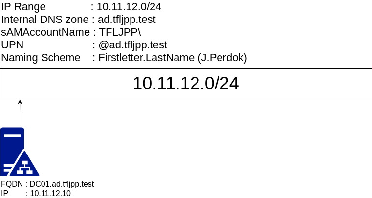

Now that you have a general understanding of Active Directory let's set one up ourselves. During this chapter we will be creating the Primary Domain Controller, also called a PDC for short. To give a general overview of what we are building we can have a look at the network diagram below. You might notice a couple of things, such as a Internal DNS Zone, ad.tfljpp.test.

## DNS

DNS is a critical part of any Active Directory environment. Whenever a server or a client want to talk to each other they will use their 'Hostname/DNS name' (DC01) or their Fully Qualified Domain Name (dc01.ad.tfljpp.test), FQDN for short. This is why during the setup of Active Directory an DNS zone is required.

We will be using a fictitious test domain called ad.tfljpp.test. The .test Top-Level-Domain (TLD) is specifically designed for test use cases and can't be resolved externally by DNS servers on the internet.

In production environments it is recommended to buy a domain for your company and use a subdomain for internal use, for example ad.company.nl. Using the same domain internally and externally is also referred to as split-brain DNS or split-DNS. Using a subdomain is an easy way to avoid issues that come with split-dns, while still keep some of it advantages, for example you will be avoiding issues where the DNS lookup for the company website fails because the internal DNS server does not have the correct DNS Record configured.

There are other methods you can choose to use, but I'd generally advise this method unless theres a very specific use case.

## Naming Scheme

The other things listed in the diagram refer to the naming scheme. It is recommended to first agree on a internal naming scheme when creating an Active Directory since this will impact on how easy it will be for your users to remember their logon name. It can be a real pain in the behind to change this on a later date.

In Active Directory you can logon with 2 user names, a sAMAccountName (SAM) and a UserPrincipalName (UPN).

### sAMAccountName

sAMAccountNames are denoted in the following format TFLJPP\j.perdok (sAM Prefix\sAMAccountName). When setting up Active Directory the setup will use the internal DNS zone as its sAM Prefix, I'd recommended changing this from the default to something unique for the environment, such as TFLJPP. The reasoning behind this has todo with intergration issues I previously ran into with external tooling.

### UserPrincipalNames

UserPrincipalNames are denoted in the following format j.perdok@ad.tfljpp.test (username@internal.dns.zone). When setup correctly you can simply the logon process for users and allow them to logon with their e-mailaddres. During this part of the guide we won't be setting up an entire Microsoft Exchange Server, but will show you how to add an extra UPN to allow for this easier method of authentication.

This could however been seen as a security risk since e-mail addresses are easy to obtain, but guessing the otherwise hidden UPN is most of the times fairly trivial or can even be disclosed by public services such as e-mail itself. Thus this is generally an accepted risk which I personally agree with. The much more simplified logon method for users outweighs the security improvements.