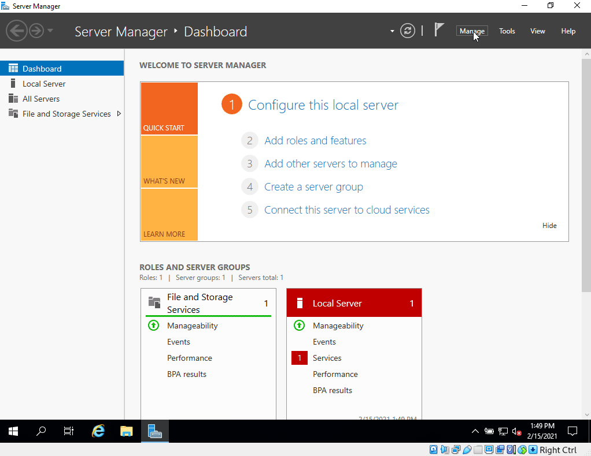
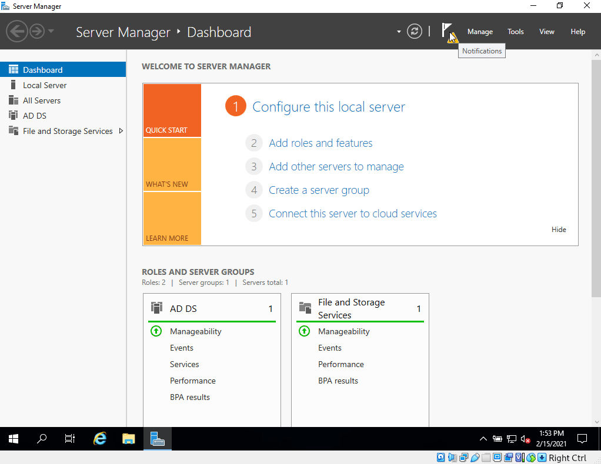
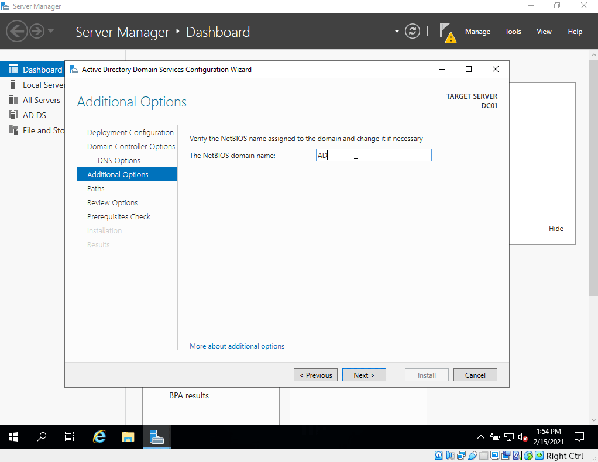
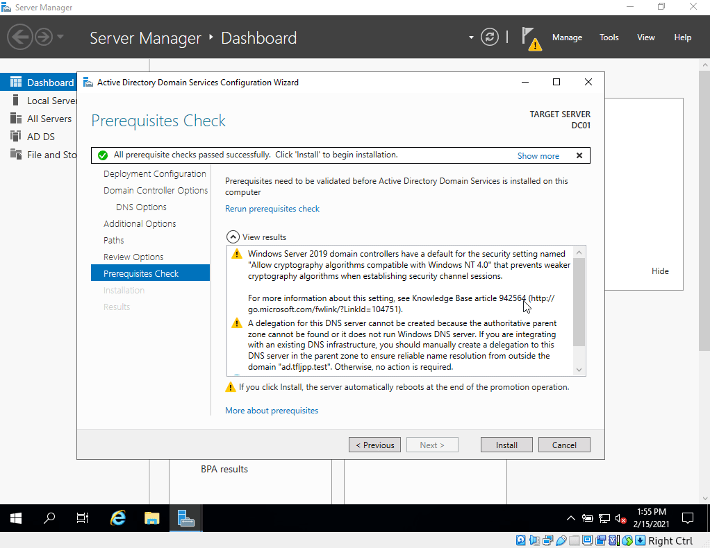
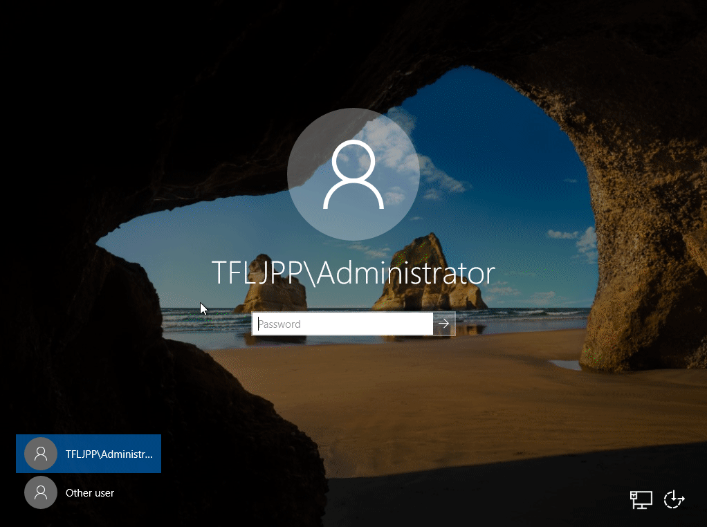

## Features and Roles

Now it's time the first Windows Role, AD DS. Before installing this Role lets first talk about what Roles and Features actually means.

Windows Roles and Features are basically programs builtin into windows server itself. These Roles and Features can be installing and uninstalling as you desire and your use case. Whether you want a server to be a file server, a print server, or a web server it all starts with installing a Role or Feature.

If you ever worked with a Linux distribution before, it's kinda similar to a package repository, only these packages are already included in the OS.



## Install the AD DS Role

## Promote to Domain Controller

