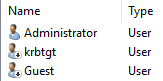
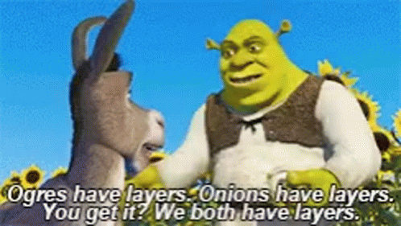

During that installation process we saw a bunch of technical terms and options fly by. These things are actually rather important things to understand if you want to learn about Active Directory, so lets cover them now!

## Domain, Tree and Forest

Before we can cover Domains, Tree's and Forests we first need to cover what objects are and the things that come with them. 

This is the stuff about AD that makes it complicated, dull and sometimes hard to grasp. So let's try to have some fun with it.

### Objects, Attributes and Classes

A object in AD is just a basic element that represents something.

It could be a user, computer, group, folders, or even a printer attached to the network.

Theses objects have these things called attributes. These attributes define and describe the objects.

For example a user object might include:

- Name;
- E-mail;
- Phone number.

Every object of the same type has the same set of attributes, some of which are mandatory while others are optional. Because of this fact we can classify them as objects part of the User class.

For example, the name of the user is something that is mandatory, while their phone number is not. But regardless of that attribute being used or not, its still a object that belongs to the user class.

#### Leaves and Containers

Objects basically come in two flavours, Container objects Leaf objects:

- Container objects can contain other objects.  
  As an example, a Group object is an container. It can contain other objects such as users or even other groups.
- Leaf objects, on the other hand, are just a single things.  
  As an example, users and computers are leaf objects and can't contain other users or computers.

To make this a bit less abstract lets think of these objects and attributes as 'physical' things.

#### The Donkeys, Ogre's, Dragons and Castles

Everything (objects) has some defining features (attributes) that make it into what it is (class).

{}

{}



All Donkeys walk on 4 legs, have fur all over their body and have a tail. These are the mandatory attributes that makes the donkey 'object', well, you known, a donkey. Because of this fact we can call this object by a class name, the Donkey class. 

Even though not all objects with the donkey class have the same height or weight (optional attributes), and in this particular example the ability to speak and sing, they are all considered donkeys because they have the mandatory attributes for its species (class).

{}
I know what you are thinking you little defiant.  
No... we can't and we shouldn't.
{}

### The Schema

So now that we know our Active Directory can contain Donkeys, Ogre's, Dragons and Castles we can talk about the Active Directory Schema. The schema of Active Directory defines the rules how a object class looks like, what attributes are mandatory and are which ones optional. It's basically a giant collection of blueprints for all objects classes in Active Directory. The schema itself is shared between all the domains (and tree's) in Active Directory (forest).

### Domain, Tree and Forest



Bare with me here, it might not fit into our last theme, but since this is the actual real terminology used by Microsoft I'd like to stick by them.

The Domain is basically the over al group that contains ALL the objects stored in the Active Directory database. A Domain can be hosted on 1 or multiple Domain Controllers (that thing we created previously). When using multiple Domain Controllers within 1 domain the changes to the [Active Directory Database (NTDS)](#ntds) are replicated between all Domain Controllers.



Regardless of how big your AD becomes or on how many locations in the world its located, when possible ([the scalability/limits are pretty huge](https://docs.microsoft.com/en-us/previous-versions/windows/it-pro/windows-server-2003/cc756101(v=ws.10)).), and I can't stress this enough, you want use a singular Domain since it simplifies AD management a ton. However this sadly inst always possible duo support for other versions [Active Directory servers (Functional Levels)](#functional-levels) or corporate shenanigans/politics.

{}
Theres also this concept called a Enhanced Security Administrative Environment (ESEA), also known as a Red Forest which Microsoft released after NotPetya hit the world. If implemented correctly this greatly reduces known attack vectors in AD, but its way to complicated to cover during this stage of the guide.
{}

#### Child Domain

Lets say that 'Threepwood's Fine Leather Jackets and Pirate Paraphernalia' wants all the Office monkeys to work in their own Child Domain. Why they would want that ? I have no idea. Lets just settle it under 'Corporate Shenanigans'. This would look something like this.



#### Tree

When you have a child domain within the same Root Domain it is referred to 'being in the same Tree'. They are however still separate domains. Each Domain needs at least 1 separate Domain Controller. This means that each Domain in a Tree has its own [Active Directory Database (NTDS)](#ntds) with its own objects such users, groups etc.



A tree can consist of multiple child domains, they can even inherent from each other, but there can only be 1 Root Domain, this is also refered to as the Tree Root. The advantage of creating these child domains from the Tree Root is that there is a trust created between each of the domains. This means that users from `monkeys` child domain can access resources in the `pirates` child domain, if they would have the appropriate rights to that resource of course.



#### Forest

Now lets say that over time the TFLJPP company grows and acquires another company, 'Wally B. Feed Cartography and Co'.
The acquired company already has a AD configured with their own Tree. You could migrate over all the users/systems from this over to your Tree, but this can be a daunting and time consuming task. So what we can do is add their Tree to our Forest. Doing this adds a trust between these two tree's. This means that, like with child domains, access to resources can now be shared cross company.



{}
There are actually other types of trusts, such as shortcut, forest, external and realm trusts. Each with different characteristics (Transitive vs. Non-Transitive), direction types (One-way or Two-way) and authentication mechanism (Kerberos V5 or NTLM). I won't go into detail's here since if I where to cover it fully it would require a lot more of preexisting knowledge of AD internals such as NTLM and Kerberos, which are even heavy topics to cover on their own. Just remember that I generally recommend against multiple domains/tree's/forest and trusts due the added complexity and security risks, unless you truly understand what you are doing/are building a Red Forest.
{}

#### What we currently build

A forest can incases multiple domains and trees into 1 structure, but doesn't have to. We actually already created a Forest and a tree when we setup Active Directory. These are created automatically.



### Global Catalog

During the installation process there was this thing called a Global Catalog (GC) that showed up.

The GC's job is to create an index of all objects from all the domains in the forest. This is needed because Domain Controllers only store information about objects from inside of their own Domain. They don't know anything about objects from other Domains. If they would need to lookup information from a object outside of their own Domain they would ask the GC for help. Any Domain Controller in a Domain can become a GC and each Domain should have at least 1 of them.

{}
For now thats all you need to know, just remember that a GC and its placement can get more complicated in large complex enterprise environments which require multiple domains, trees and forests.
{}

## Functional Levels

As you might remember from earlier, roles are builtin packages into Windows Server. This means that each release of Windows Server might have different version of the builtin packages. The AD DS Role is a great example of this.

Over the years with new releases of Windows Server new functionality has been consistently added to AD. This means however that you can run into issues if you where to support these new features while still having old Domain Controllers. This is where Functional Levels jump in. 

Functional Levels determine which version of Windows Server are allowed to host the AD DS role in the domain. During the installation process we use a Domain Functional Level of Windows Server 2016, since we want to make use of the newest features. This means that we can only create Domain Controllers using at least Windows Server 2016. Any version lower, for example Server 2012R2, will not be able to be promoted to a Domain Controller is this Domain or other Trees in this forest.

{}
The tech savvy among you probably already thought of a work around. Yes you could create new child domains or forests for the purpose to support older or new versions of AD DS, though it is highly recommended phase out older Windows Servers running Domains Controllers in your Domain in favor of newer version of Windows Server. This allows you to use most recent functional level and make use of the newest features, a lot of which have been security focused.
{}

## RODC

RODC are Read-Only Domain Controllers. Though we did not install one, i'd still like to cover it briefly.
Read-Only Domain Controllers can be used for some specific use cases such as branch offices where you would not want to host a full Domain Controller for security reasons. These locations could be physically less secure. By default, no AD account passwords are cached on a RODC and the Domain does not allow no changes originating from a RODC's AD database, SYSVOL, or DNS.

A Read-Only Domain Controller would allow people in this branch office to still authenticate if, lets say, their VPN connection to the main office went down. [Though if RODCs are not deployed properly, it's possible that the RODC can create a scenario where an attacker could escalate privileges through the RODC up to and including full control of Active Directory.](https://adsecurity.org/?p=3592)

## NTDS

NTDS is the file that contains the Active Directory Database. It stores all the information about the Domain of which the current Domain Controller is part of.

{}
As an attacker going after AD this is **the** file we want to get our hands on. This file contains every user attribute, including normally protected and hidden attributes such as the users password (hash). After gaining access to this file we are able to start cracking user passwords, create magic a [GoldenTicket](http://blog.gentilkiwi.com/securite/mimikatz/golden-ticket-kerberos) and do other 'fun' stuff.
{}

## SYSVOL

SYSVOL is a folder that exists on all Domain Controllers. It a central place to store important Active Directory files, such as Group Policies (GPO's for short), ADMX files (Extra group policy templates) and logon/logoff/startup/shutdown scripts that each user and computer account in the domain should have access to. A service called `File Replication Service` or FRS for short, replications the contents of the SYSVOL folder among Domain Controllers in the Domain. This way if a new Logon scripts or GPO is added on 1 Domain Controller it gets replicated to all other Domain Controllers in the Domain.

{}
As an attacker this a great place to search for information about the Domain. More often then not we can even find credentials stored in SYSVOL (and NETLOGON), even though this should not happen ([anymore](https://adsecurity.org/?p=2288)).
{}

## FSMO

Another thing we didn't see yet, but is closely related to the initial setup of AD, are 'flexible single masters of operation' or FSMO for short. FSMO consist of 5 roles and currently all reside on our newly created DC:

- Schema master  
  Schema master controls the Schema changes in any active directory forest.
- Domain naming master  
  Domain Naming master controls addition or deletion of domains in a forest.
- RID master  
  Every AD object that we create gets an RID (Relative Identifier) number which defines which DC the AD object belongs to. If any DC runs out of these RID numbers it contacts the RID Pool Manager and get new pool of RIDs for further distribution.
- PDC emulator  
  The PDC emulator is necessary to synchronize time across a network
- Infrastructure master  
  The infrastructure master is responsible for updating references from objects in its domain to objects in other domains.

Right now its not important to go into more detail about these roles, since you most likely never have to tinker with them. Except when you start phasing out older Domain Controllers.

Make sure you always check where the current FSMO roles reside before removing any Domain Controller from the domain. If they are currently hosted on the DC you want to phase out you need to move them over to another DC.
