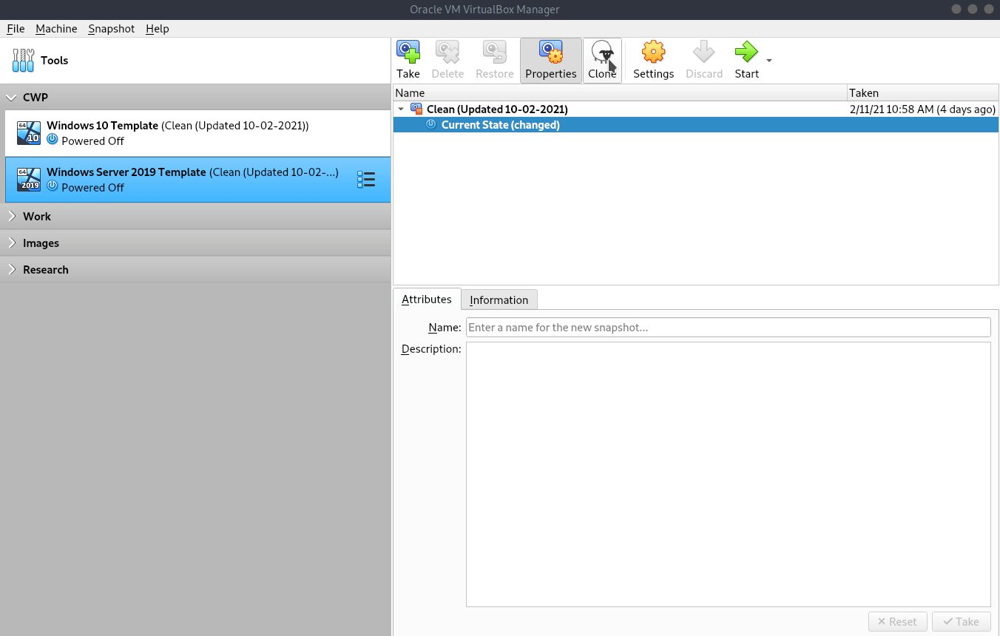
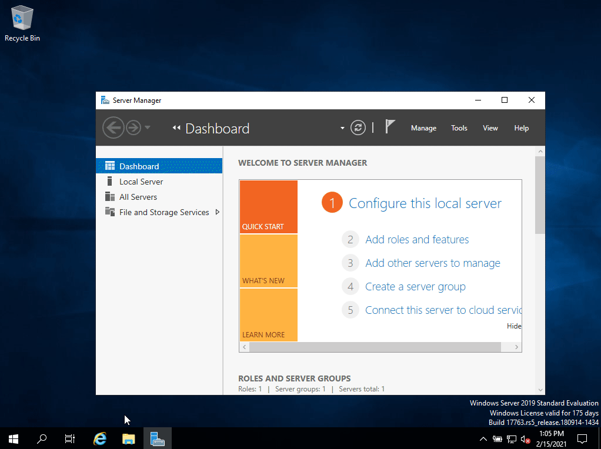
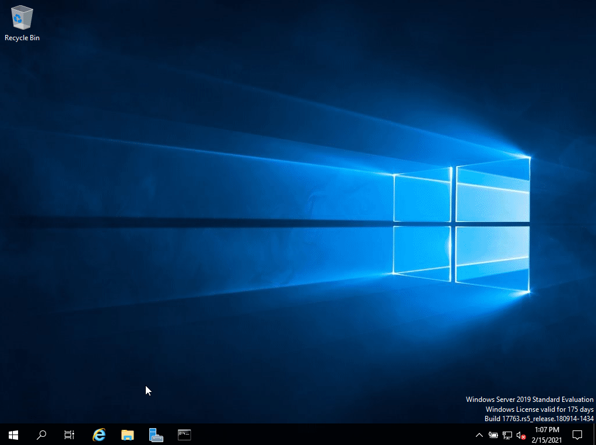

## Prepare Windows Server

Before we can install the AD role, we need make sure that the windows VM is setup correctly. Let's first create a new linked clone from the Server 2019 Template.

Click on the VM and then click on Clone.

Rename the VM to dc01.ad.tfljpp.test and ensure 'Linked Clone' is selected, then click on Clone.

After cloning right click on the VM and click on settings, then go the network and change the 'Attached to' to 'NAT Network'. This should automatically select the newly created VirtualBox Network.

Now double click on the DC01 to startup the machine. Login and click on yes for the network popup.

### Setting a static IP address

Normally in a network the DHCP server gives out IP addresses to clients. This is fine for clients that don't host any 'things', but not so much for servers.

Let's say for example if we decided to use DHCP for the Domain Controller (DC). If DHCP decides to release the assigned IP address that the DC is currently using and grant it a new one it will completely break AD.

#### The Why

Why may you ask?

Because as we denoted to earlier AD heavily depends on DNS. One of the DC's functions is to host an DNS service in the network.

All the clients/servers in the network are configured to use the IP of the DC as its DNS server. If DHCP gives the DC a new IP, let's say 10.11.12.137, all the DNS lookups of all the clients/servers in the network will now stop working, since there is no longer a DNS service running on their configured DNS server. This will prevent all clients from authenticating to AD and will break a lot of other things such as, for example, internet browsing.

#### The how

Open the file explorer and right click on 'Network' and choose 'properties'.
Then click on Ethernet, choose properties, Internet Protocol Version 4 (TCP/IPv4) and enter the following information.

| IP Address  | Subnet Mask   | Gateway    | DNS     |
| ----------- | ------------- | ---------- | ------- |
| 10.11.12.10 | 255.255.255.0 | 10.11.12.1 | 8.8.8.8 |

Note: your gateway might be different if you didn't setup the Virtual Network properly or choose another IP range. To verify what your current gateway is: Click on start and search for CMD. Then type ipconfig and press enter.

After changing the settings, we can verify if everything is setup correctly by sending a ping to google.nl.
Click on start and search for CMD. Then type ping google.nl and press enter. It should then ping and reply 4 times.

### Changing the computer name

#### The Why

Currently the server is called something like WIN-ABCDEG12345. Not really a name indicating what the porous of this server is now does it right? This is fine if you have 2 or 3 servers, but once you are part of a large IT team and have over 100 servers this can get quite confusing. Therefore its important to rename servers to a name that clearly defines their function.
In this case since it's the first DC we can call it DC01.

In a production environment it's recommended to prefix this name with a company/domain abbreviation, such as TFLJPP-DC01. But for this small lab DC01 is fine.

#### The how

Open the file explorer and right click on 'This PC' and choose 'properties'. Then click on 'Change Settings' and 'Change'. Here you can update the computer name to DC01. Now click on Ok twice and close. You will then be prompted to reboot the server.

