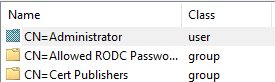
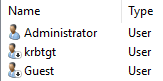
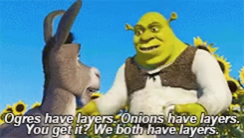

A object in AD is just a basic element that represents something.

It could be a user, computer, group, folders, or even a printer attached to the network.

Theses objects have these things called attributes. These attributes define and describe the objects.

For example a user object might include:

- Name;
- E-mail;
- Phone number.

Every object of the same type has the same set of attributes, some of which are mandatory while others are optional. Because of this fact we can classify them as objects part of the User class.

For example, the name of the user is something that is mandatory, while their phone number is not. But regardless of that attribute being used or not, its still a object that belongs to the user class.

#### Leaves and Containers

Objects basically come in two flavours, Container objects Leaf objects:

- Container objects can contain other objects.  
  As an example, a Group object is an container. It can contain other objects such as users or even other groups.
- Leaf objects, on the other hand, are just a single things.  
  As an example, users and computers are leaf objects and can't contain other users or computers.

To make this a bit less abstract lets think of these objects and attributes as 'physical' things.

#### The Donkeys, Ogre's, Dragons and Castles

Everything (objects) has some defining features (attributes) that make it into what it is (class).

{}

{}



All Donkeys walk on 4 legs, have fur all over their body and have a tail. These are the mandatory attributes that makes the donkey 'object', well, you known, a donkey. Because of this fact we can call this object by a class name, the Donkey class. 

Even though not all objects with the donkey class have the same height or weight (optional attributes), and in this particular example the ability to speak and sing, they are all considered donkeys because they have the mandatory attributes for its species (class).

{}
I know what you are thinking you little defiant.  
No... we can't and we shouldn't.
{}
