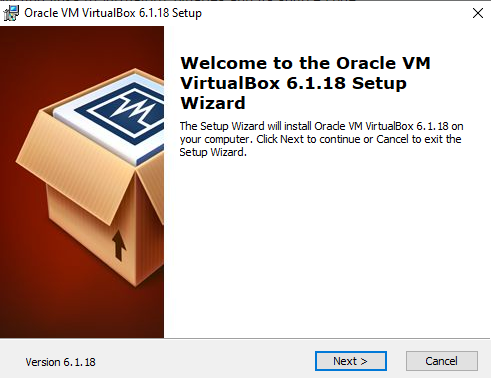
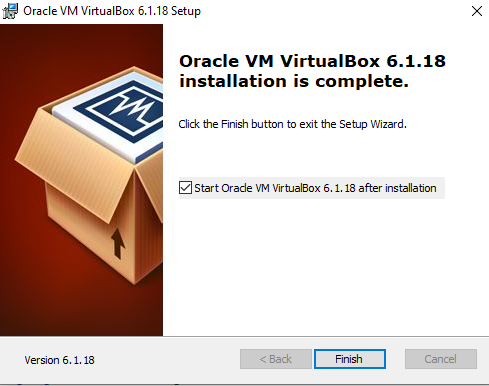
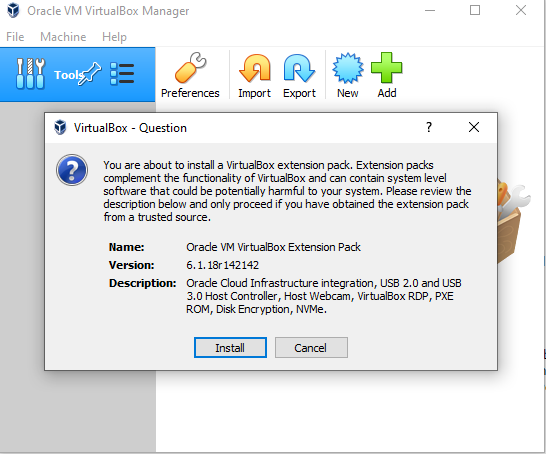
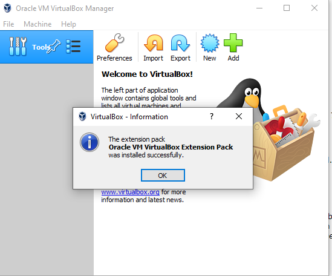

Next we need a virtualization application. For this guide we will use Virtualbox.

## Required Downloads

First download the 2 files listed below.

|                           | URL                                                                                                       |
| ------------------------- | --------------------------------------------------------------------------------------------------------- |
| VirtualBox Application    | https://download.virtualbox.org/virtualbox/6.1.18/VirtualBox-6.1.18-142142-Win.exe                        |
| Virtualbox Extension Pack | https://download.virtualbox.org/virtualbox/6.1.18/Oracle_VM_VirtualBox_Extension_Pack-6.1.18.vbox-extpack |

## Virtualbox Application

Once they are finished open the VirtualBox Application download. This will start the installation process of Virtualbox.

Just keep click in on Next until the installation is finished.

Once it's finished start Virtualbox.

## Virtualbox Extension Pack

Now that Virtualbox is installed we can install the Extenstion Pack. Open the second file you downloaded. This should prompt the screen below.

Scroll down the licence agreement and click on I Agree.

Afterwords it should start installing the extension pack.

