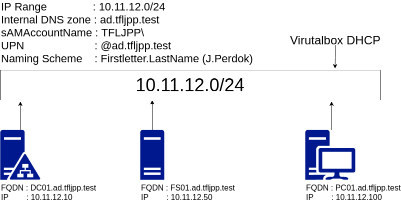

During this chapter of the guide will be extending our current Lab with a file server.

- ~~Store information about members of the domain (such as devices and users);~~
- ~~Providers central authentication for the network;~~
- ***Allows or restricts access to resources/applications in the network;***
- Enforce the appropriate configuration/policy of user or computer settings.

