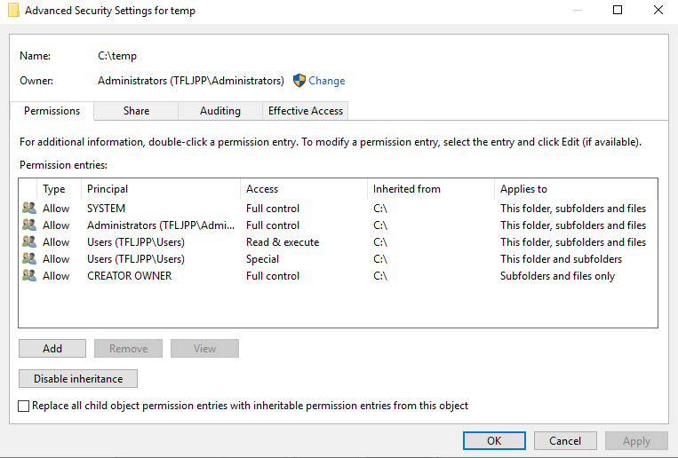
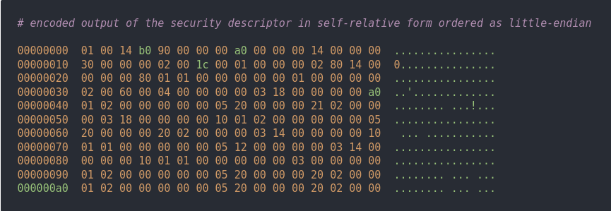
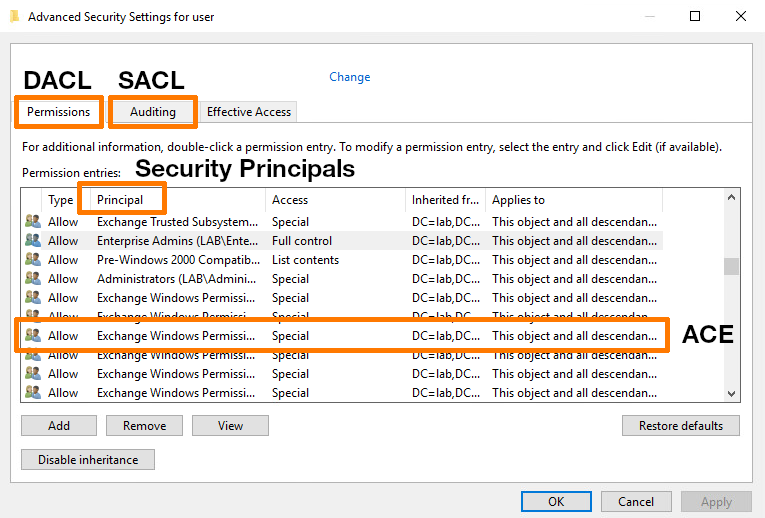
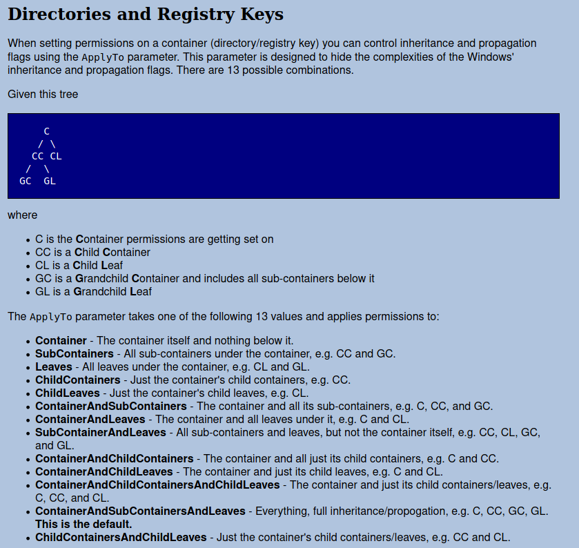

Before we start some much needed terminology. Remember when we covered `Security Principals` ? You know, things that can authenticate, for example a user account, and has SID's (the thing that starts with `S-1-5-21`). There we briefly explained that "something", for example a file share, can be protected. In order to access this you first needed to authenticate to proof you you are. Then you needed to be part of a specific group. In that example the specific group was added to the `Security Descriptor` in order to actually grant you the needed rights.

As it was with `Security Principals`, `Security Descriptors` are also heavily part of the Windows Operating system. They also happened to be used for Active Directory.

You might have seen the screen below before if you ever opened Advanced Security Settings on a folder to change NTFS rights. What this screen actually does is a give you a easy interface to edit parts of `Security Descriptors`. Instead of just showing you how to use this interface I'd like you to at least first know about these internals.



### So what is a Security Descriptor ?

A `Security Descriptor` is a description on how a object is secured. It is stored as a binary data structure, meaning you and me can't read it easily, but a computer can. As an example, below is a such a binary data structure.



The SD usually contains the following information:

- The owner of the object;
- The primary group of the object (though often its not used);
- The Discretionary Access Control List (DACL);
- The System Access Control List (SACL);
- Control information.

In this case the owner is a `Security Principal`, for example a User Account. However, internally, the `Security Descriptor` does not use user's name, it uses those unique strings, SID's, instead. This is true for any reference to a `Security Principal` (a object that can be used to authenticate).

A lot of things are protected with a Security Descriptor, for example:

- Files and Folders ('NTFS Rights');
- Registry keys;
- Network shares;
- Printers;
- Services running on Windows;
- Active Directory objects;
- Processes running on Windows.

{}
The `Security Descriptor` binary data structure can be converted to a string format using the `Security Descriptor Definition Language` (SDDL). The example we showed above would be translated to the following SDDL:`O:BAG:BAD:P(A;CIOI;GRGX;;;BU)(A;CIOI;GA;;;BA)(A;CIOI;GA;;;SY)(A;CIOI;GA;;;CO)S:P(AU;FA;GR;;;WD)`. [If you want to see a practical implantation on how to use SDDL's, here is an example of a project that uses SDDL and changes to Security Descriptors to monitor for Acess Control Entry changes in Active Directory.](https://github.com/justin-p/MonitorACEChanges#example-2-use-eventid-5136-and-known-good-sddl-values-to-detect-changes-in-aces)
{}

### The make up of a Security Descriptor

### Owner

An object can have an owner, but does not need to have one, though most objects do. The owner of an object has the privilege of being able to manipulate the object’s rights (the DACL) regardless of any other settings in the Security Descriptor.

### Primary Group

The primary group of an object is rarely used. Most services and applications ignore this property.

### DACL

When editing rights on objects you create Access Control Entries (ACE). A list of these ACEs is called an Access Control List (ACL), which come in two types, DACL's and SACL's. A DACL identifies which `Security Principals` are allowed or denied access and what they can and can't do.



### SACL

The SACL is like a DACL, only it controls how and if access to a object is audited. If its audited these changes are written to security event logs.

#### Control Information

The control information contains various `bit flags`, meaning options that can be turned off or on. The most importent flags are whenever a DACL or SACL are protected from inheritance. Meaning that rights defined 'from above' can't be 'pushed down' to this object.

### Access Control Lists (ACL) and Access Control Entries (ACE)

In a moment when we will be setting up a file share will heavily make use of Access Control Lists and thereby Access Control Entries. As we mentioned during the explication of DACL's, a Access Control Entry are the entries you make in a DACL. An important note with ACL's is that if there is no matching rule a object does not have access. In order to be allowed access there needs to be a explicit rule (ACE) that gives that object access.

This principal is also revered to a `Whitelisting` and is the opposite `Blacklisting`, where you allow everything by default and blocking specific things.

For example, when you create a rule that says G.Threepwood has `Read and Write` rights to a folder this is a called a ACE. If we create multiple of these ACE's we call this group a Access Control List (ACL).

ACEs come in a couple of flavours. These are listed below.

| Flavor           | Used by |
| ---------------- | ------- |
| Access allowed   | DACL    |
| Access denied    | DACL    |
| Access succeeded | SACL    |
| Access failed    | SACL    |
| Access all.      | SACL    |

All of these ACE flavours always contain the following information.

- A SID of a object to whom the ACE applies to;
- The permissions to grant/deny/audit (also called the Access mask);
- How to propagate the ACE's settings 'downwards' (Inheritance flags, one the `bit flags` we talked about during Control Information).

Just like how we can create a ACE that grants permission to a User, we can create a ACE that explicitly denys permissions. In case of a conflict (both allow and deny ACEs are present), the deny ACE always has precedence!

{}
Make sure you always avoid using deny permissions. As we explained earlier, by default if there are no ACE's someone can't access a object. This basically means if you think you need to implement Deny access ACEs you might want to redesign your right structure. The only time I implemented Deny permissions in production environments was to (automatically) block users from File Shares who where infected by Ransomware to avoid further damage.
{}

### Inheritance

To simplify ACE management Microsoft introduced the concept of inheritance. Each ACE has a bit flag that controls how the ACE is applied to child objects. The most common used type used by Windows is full inheritance. Here child objects inherit all ACEs from their parent and therefore have identical permissions.

{}
When an ACE is inherited it cannot be modified directly on the child object! If you want different to remove this ACE on the child object you would need to disable inheritance on this object.
{}

Let's imagine the following folder and rights structure.

```
C:\ (ACE: administrators has Full Control)
|
-> C:\users\ 
   |
   -> C:\users\G.Threepwood\ (ACE: G.Threepwood has Read and Write)
   |
   -> C:\users\E.Marley\ (ACE: E.Marley has Read and Write)
```

In this scenario the full ACL of `C:\users\G.Threepwood\` would look like this:

| Security Principals | Permissions    |
| ------------------- | -------------- |
| Administrators      | Full Control   |
| G.Threepwood        | Read and Write |

Now duo the magic of Inheritance, if where add a new ACE to `C:\users\` that gives the group `HelpDesk` the `Read and Write` permissions the full ACL of `C:\users\G.Threepwood\` would now look like this:

| Security Principals | Permissions    |
| ------------------- | -------------- |
| Administrators      | Full Control   |
| HelpDesk group      | Read and Write |
| G.Threepwood        | Read and Write |

Meaning we don't need to update any subfolder by hand. This now ACE is automatically "pushed down" to all subfolders in `C:\Users`.

#### Inheritance Flags

It is, of course, possible to specify exactly how an ACE is to be inherited by child objects. The following inheritance flags can be used individually or in any combination:

- container inherit: child containers (e.g. directories) inherit the ACE;
- object inherit: child objects (e.g. files) inherit the ACE;
- inherit only: the ACE does not apply to the object itself, but can be inherited by children;
- no propagation: the ACE may not be inherited by children.

The settings available in Windows ACL Editor correspond to the following combinations:

- This folder only: no propagation;
- This folder, subfolders and files: container inherit + object inherit;
- This folder and subfolders: container inherit;
- This folder and files: object inherit;
- Subfolders and files only: container inherit + object inherit + inherit only;
- Subfolders only: container inherit + inherit only;
- Files only: object inherit + inherit only.

Inheritance and all these flags will probably seems confusing right now. I didn't understand this at the start either. I started to understand this by setting up File Shares (and **a lot** of trial and error). Reading the documentation of a PowerShell Module named Carbon helped, specially the 'Directories and Registry Keys' part of the [Grant-Permission function](https://get-carbon.org/Grant-Permission.html). Though this does not directly reflect to the ACL editor of windows it gave me enough information to figure out what the options in the editor do.

