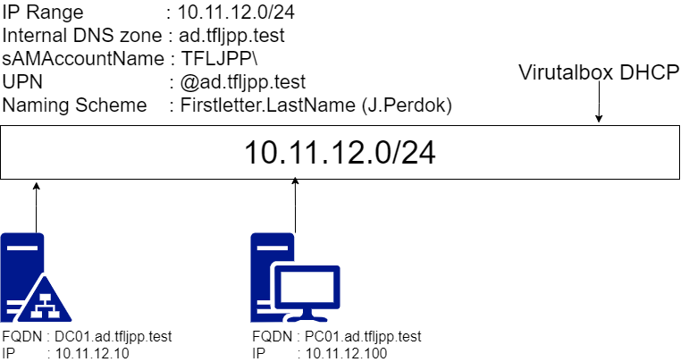

During this chapter of the guide will be extending our current Lab with a new member, a Windows 10 machine called PC01. PC01 will be added to the Domain and will get a static IP of `10.11.12.100`.

Will also cover how AD provides central authentication, meaning after this chapter you got down another core feature:

- ~~Store information about members of the domain (such as devices and users);~~
- ***Providers central authentication for the network;***
- Allows or restricts access to resources/applications in the network;
- Enforce the appropriate configuration/policy of user or computer settings.

