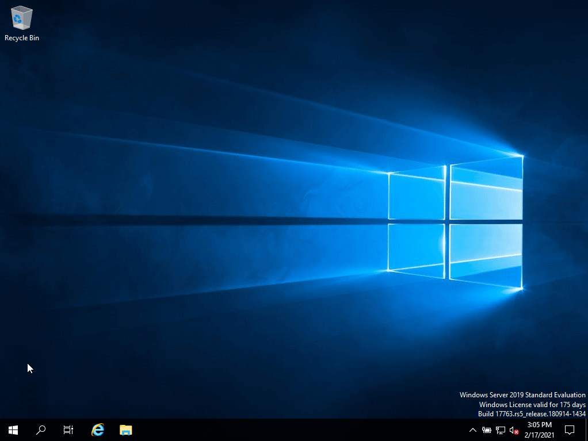

So no that we have this thing called Active Directory, how do we actually use it? Well for now most of the work you will be doing will use the tool `Active Directory Users and Computers` (ADUC).

Since it's a tool you are going to use a lot I'd recommend you pin to to your taskbar. To open ADUC click on `Start -> Windows Administrative Tools -> Active Directory Users and Computers`.

After opening ADUC right click on the taskbar icon and choose `Pin to taskbar`.

