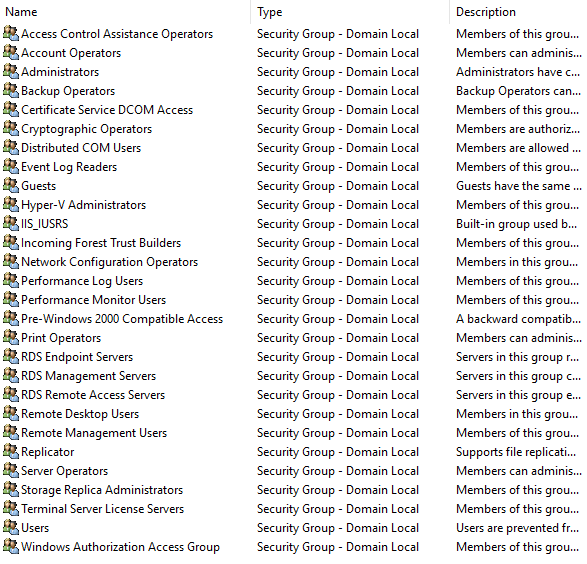
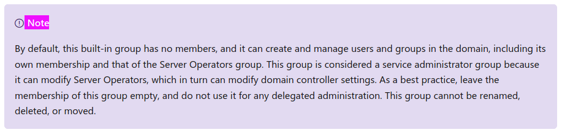
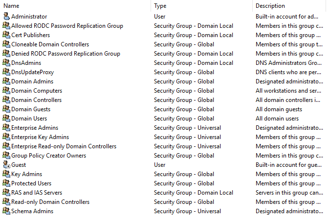
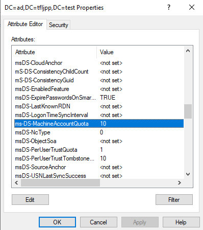
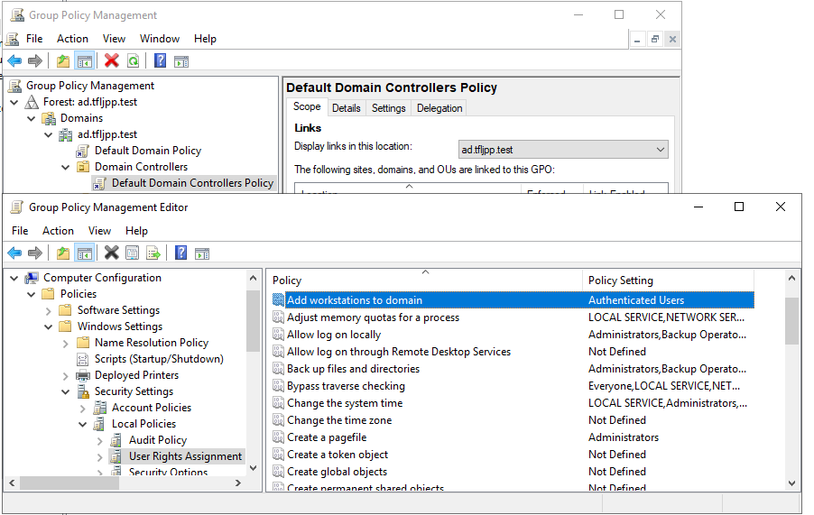

When you first open your Domain in ADUC you will be greeted with a couple of default objects. In some cases it is possible to move these objects, but I strongly recommend you don't. There are a few exceptions though, but lets not go into that right now. Let's first talk about these default objects and what is inside of them.



## Containers VS Organizational Units

As you might have noticed, some of these have the type 'Container' while others have the type 'Organizational Unit' (OU's), even though they almost look the same and they all have the description 'Default container for...' they are different things. As is with most things in the '[Microsoft World](https://www.youtube.com/watch?v=UQvm5_OweF8)', whenever this is the case it most likely has to do with backwards compatibility.

In this case the 'Containers' are generic Active Directory containers. Both OU's and Containers have the ability to house other objects, such as users and computers, and are thus considered Container Objects (instead of Leaf objects). The main difference between Containers and OU's is that Containers can't be used with Group Policy Object (GPO's) or delegation.

Well what are GPO's you might ask? Well that is a topic we need to tackle on it owns. To give a really basic explanation, GPO's allow administrators to configure settings and preferences for users and computers, like setting a default home page in a webbrowser. Pretty much any modern AD environment uses GPO's in some form.

{}
**TL:DR** Containers are Old. Organizational Units are new. Both can house other objects. You want to use OU's because they work with GPO's.
{}

## Different Default Containers

### Builtin

The container 'Builtin' contains 28 groups that created by default when you install Active Directory. Generally I don't mess with these groups, unless I'm hardening Active Directory.

{}
Microsoft's own documentation tells you that these groups are added to ['help control access to shared resources and to delegate specific domain-wide administrative roles'](https://docs.microsoft.com/en-us/windows/security/identity-protection/access-control/active-directory-security-groups#default-security-groups). What they don't tell you (upfront) is that some of these groups actually come with a security risk and that its against best practices to actually use these groups. This is because by default these groups give [you access to resources that you might not expect them to](https://adsecurity.org/?p=3700) and can potentially be used by attackers to escalate privileges within your AD. Just search for 'note' on [this](https://docs.microsoft.com/en-us/windows/security/identity-protection/access-control/active-directory-security-groups) page. 
{}

### Users

Not quite the order you see in ADUC but there's a reason for that 😉. This OU, weirdly enough if we look at the name, contains default users **and** groups. Again, generally I don't mess with these groups, unless I'm hardening Active Directory.

By default new users that are added to the Domain will end up in this OU. As you will learn shortly, when you use ADUC you can create a user in any specific OU you want, but there are actually other ways to create an AD user. Examples are the PowerShell command `New-ADUser` or the older NET command `NET USER`. In the case of `NET USER` you [can't choose which OU](https://docs.microsoft.com/en-us/previous-versions/windows/it-pro/windows-server-2012-r2-and-2012/cc771865(v=ws.11)) a user is created in.

You can update the default location using a tool called [Redirusr](https://docs.microsoft.com/en-us/previous-versions/windows/it-pro/windows-server-2012-r2-and-2012/cc771655(v=ws.11)).

{}
The `NET USER` command is often used by attackers to create a backdoor account and establish some form of persistance in a environment. Meaning if you change the default Users OU to a location where no user should ever be created, you could use this as a indication of 'Something has gone wrong' (indication of potential comprise), especially if this user also gets added to high privilege groups such as Domain Admin. You can even take this a step further and lockdown users that are added to this OU with GPO's, removing default privileges that are normally present for users.
{}

### Computers

This is the default OU where new computers that are added to the domain will end up. Since this is a Container and not a OU there can't be any Group policies applied to objects in this OU. This is why I recommend changing the default location where computers are added. This allows you to ensure when a new computer is added to the Domain you can enforce GPO's to be applied. Examples of GPO's you might want to add are ones that lockdown the system and push Anti-Virus.

You can update the default location using a tool called [Redircmp](https://docs.microsoft.com/en-us/previous-versions/windows/it-pro/windows-server-2012-r2-and-2012/cc770619(v=ws.11)).

{}
This is important since, by default, you **don't** need any form of administrative rights to add a computer to a Domain, a regular user account will do. There's a attribute called `ms-DS-MachineAccountQuota` which allows users to add up to 10 computers to the Domain by default.
There's also another thing that enforces this, called, `Add workstations to domain` (`SeMachineAccountPrivilege`). This is a `User Rights Assignment` which is set by default in the `Default Domain Controller Policy` GPO.
{}

{}
It is not recommended to let users add their own computer to the Domain. Best Practices is to set the `ms-DS-MachineAccountQuota` to `0`. When a user adds a PC to the Domain using it's own account several privileges are added to the computer object, such as a `GenericAll` ACE. You should also not be using an account that has (domain/enterprise) Administrative rights in the Domain. The recommended way is to create an account whose sole purpose is to join Computers to the Domain. This account should not be part of any administrative groups and only get specific delegation rights (`Create Computer objects`) on the OU that will be used to house new computers temporally. The computers should be manually moved to the correct OU. This allows you to create a OU that locks down any (potentially) unknown computer that gets added to the Domain in the edge case that this dedicated account gets compromised.
{}

### Domain Controllers

This is the default locations Domain Controllers are placed. As you might notice this is created as a OU. This is because by default a GPO is applied on this OU, the `Default Domain Controller Policy`.

### ForeignSecurityPrincipals (FSP)

An FSP is an AD object that points to another object (a user, computer, or group) from a domain of another forest. When these are created they are added to this Container. If you don't work with other forests you will likely not see much of them.

### Managed Service Accounts (MSA)

Managed Service Accounts (MSA) and Group Managed Service Accounts (gMSA) are great.
Basically a MSA is a type of account that can be used as Service Account. Service Accounts are accounts designed to run services, such as a SQL database.
There is nothing special about that, the magic sauce is that these accounts have automagically rotating and strong passwords.

Traditionally service accounts need high privileges in a Domain. What I usually see in Customer environments is that somebody in 2008 created a new account using a very weak and simple password, like `Welkom01!`, and configured this account to run a SQL database. While doing so they added this account to a high privilege group, for example Domain Admin.

Since changing the password of that user will break the SQL database (unless the service running the database is manually updated to use the new password) this password gets rarely, if ever, changed. Using some methods that are currently to complicated to explain (for example [kerberoasting](https://adsecurity.org/?tag=kerberoast)), we as an attacker are able to request a password hash and try to crack this passwordhash. As you can might imagine, `Welkom01!` is pretty easy hash to crack.

{}
Even though MSA (2008) and gMSA's (2016)  have existsed for some time now I rarely see them used at customers.
{}
