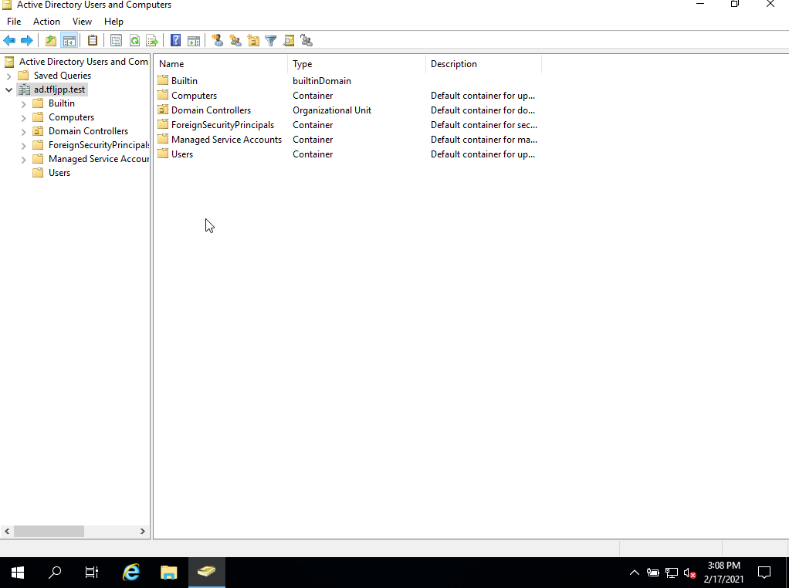
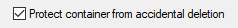
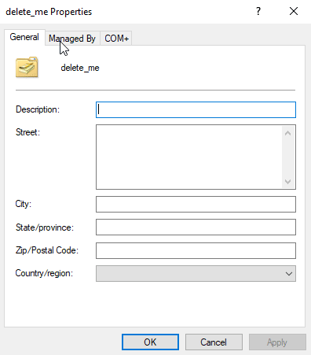
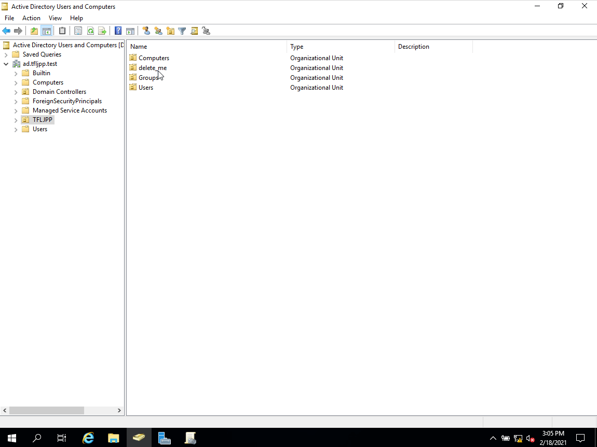

Let's start with creating our first OU. I recommend, that for any AD environment you create, you start with 1 OU that houses all the objects you are going to create. I usually use a abbreviation of the company name, most likely the same one I used for the NetBIOS domain name (**TFLJPP**\username).

To create an OU open ADUC, click on your FQDN and then right click in the main window.

This should give you a menu that allows you to select `New >`. This will span a second menu that allows you to create new AD Objects. Here you choose `Organizational Unit`.

Now give this OU a name, in this case `TFLJPP` and click on OK (or if you are lazy, press Enter).

Now open this newly created OU and create 3 more OU's. `Users`, `Computers` and `Groups`.

### Protected container

During the creation of the OU you saw this option that said 'Protect this container from accidental deletion'

This basically mean whenever you try to remove this object you are prompted with this error message.



Now if you open this OU and look at its properties this option is no where to be found. This is because it his hidden in the 'Normal Mode' of ADUC. To edit this option you need to first enable 'Advanced Features' in ADUC.

#### Enable Advanced Features

In ADUC go to `View -> Advanced Features`.

{}
Remember when I talked about the Default Objects? There are actually a bunch more. Since you just enabled `Advanced Features` you are now able to view these. For now you can just ignore them. It's not important to cover them right now. But as an example, NTDS Quotas allows you to implement quota's for object creation which you can apply to administrators accounts and LostAndFound is used for when a objects becomes orphaned which can happen if multiple people perform maintenance in Active Directory.
{}

Now go back the OU and right click on it, choose properties. You will now have a couple more tabs on the top. If you open the `Object`-tab you will see there is a option to disable the protection from accidental deletion.

