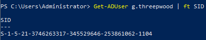

### Security Principals and SIDs

Security Principals are types of objects that can be used to gain access to something. To do this Security Prinicpal needs to be able authenticate against the Operating System. The OS then does an Access Control checks to see if this Security Prinicpal has access to the requested resource. It then either allows or denies it access. Security Principals are not just used in Active Directory, but even by standalone version of Windows. To keep track of Security Prinicpals each are assigned a unique security identifier (SID).

{}
If you ever see a string that starts with `S-1-5-21` you know its a SID. 
{}

### Authentication and Access Control

For example, lets say if Guybrush Threepwood wants to access content a file share called `pictures`. This file share is protected and requires people who want to access it to be part of the group Active Directory group named `FOL_Pictures_R`. Guybrush's Active Directory account is member of this group.

Before Guybrush is able to access this file share he will need to authenticate. Since this share is protected by a group that is part of Active Directory he authenticates to that with his Username and Password. In this process he is proving that he is actually Guybrush Threepwood, Mighty Pirate, and not some random Office Monkey.

After authenticating to Active Directory it will check if Guybrush's account is part of the `FOL_Pictures_R` Group. Since it is Guybrush is allowed to access this file share.

{}
This is a very simplified version of the internal authentication used by Active Directory. There are actually a bit more things involved and that will depend on what authentiation method is used.
{}
