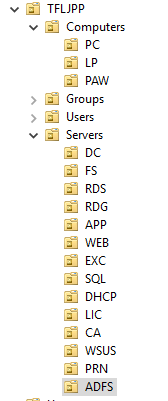

We have yet to add a computer to our domain, but since a computer is also a security principal I like to shortly cover it here.

{}
A generally unknown fact. in AD computer accounts are just like user accounts. This is because if you do something in the context of a computer object AD see this as a 'Authenticated User' duo it being a security principal. They are generally able to preform the same actions a default user can do, such as add more computers to the domain and read/update AD object attributes. This can be handy feature for attackers.
{}

### Naming convention

I always implement a strict naming convection for my computers in any environments. These naming conventions are not the same at every company, but I think they all should have one.

General rules I follow with the naming convention for computers:

- Always use uppercase.
- Always add subsequent numbers.

Since computers can have different types of functions I generally use the following naming convention:

| name | What its used for                    | Example |
| ---- | ------------------------------------ | ------- |
| PC   | User workstations                    | PC01    |
| LP   | User Laptop                          | LP01    |
| PAW  | Privileged Access workstation        | PAW01   |
| DC   | Domain Controllers                   | DC01    |
| FS   | File Servers                         | FS01    |
| RDS  | Remote Deskop Host Servers           | RDS01   |
| RDG  | Remote Destkop Gateway               | RDG01   |
| APP  | General application servers          | APP01   |
| WEB  | Web server                           | WEB01   |
| EXC  | Microsoft Exchange Server            | EXC01   |
| SQL  | SQL servers                          | SQL01   |
| DHCP | DHCP Servers                         | DHCP01  |
| LIC  | License Servers                      | LIC01   |
| CA   | Certificate Authority                | CA01    |
| WSUS | Windows Update services              | WSUS01  |
| PRN  | Print server                         | PRN01   |
| ADFS | Active Directory Federation Services | ADFS01  |

I also create separate OU's for each computer/server type and ensure that the description explains their function.

