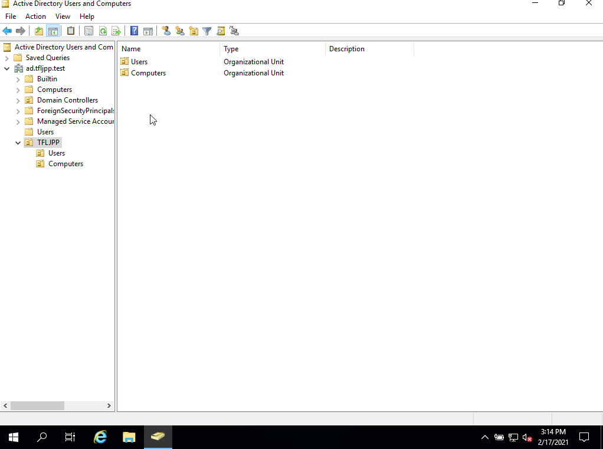

## Create a new Group

Now that we have a User lets create a group to place it in. Create a OU for groups if you haven't already and open it. Right click in the main window. This should give you a menu that allows you to select `New >`. This will span a second menu that allows you to create new AD Objects. Here you choose `Group`. Now enter the group name `Mighty Pirates` and press `OK`.

Now double click on the group and click on the `Members`-tab. Here you can add other objects to this group. Click on Add, type `Guy` and click on `Check names`. This should autocomplete to the user `G.Threepwood@ad.tfljpp.test`, then click on `OK`.

You might have noticed 2 more options. Group Scope and Group Type.

### Group Scope

In 'Microsoft'-land there are actually 4 different kind of group scopes. How you should use these all comes down to best practices, performance and how 'tidy' you can keep your AD.

Most of the things explained below are (mostly) not technically enforced but you should follow them non the less if you are working in a production environment.

- Universal Groups  
  You generally only need to use these when you have have multiple Domains in a Forest. These allow you to created bridges between Domains so to say.
- Global Groups  
  These are groups that should contain Users, Computers or other Groups. These groups should **not** be used to give rights to resources.
- Domain Local Groups  
  Groups that should contain other Groups, such as Global Groups. These group **should** be used to give rights on resources.
- Local Groups  
  Groups locally stored on a Windows Machine. Creation of these should generally be avoided. When needed add Domain Local groups to existing local groups. For example, add a Domain Local group called 'APP_Allow_RDP_to_PC01' to the local group 'Remote Desktop Users' group.

To make this a bit clearer look at the following example. Here you can see this structure in practice.

When users are added to a Global Group they automatically get all the rights the Global Group has. This even works if this Global Group is member of another group, in this example a Domain Local group that gives rights to a resource. This works because of group inheritance.



like I said, there is no technical limitation that beholds you to this structure, but, when implemented correctly this simplifies AD management a lot. Just look the 2 examples below.



Yes. This might be a lot more work for the initial setup, and yes, it might seem convoluted at first when you are starting out.

To setup something, like for example file permissions, you could just create a Global Group, add users to it, and give it rights directly somewhere. But trust me, this will eventually bite you in the ass. Using the structure I explained above will save you a ton of work in the long wrong; Fixing issues other people created, awkward phone calls with clients why someone suddenly had more permissions then they needed and general waiting around.

{}
You should also **NEVER** directly add a user to a resource, for example a network share, in a production environment. Always work with groups to give out permissions.  
{}

### Group Type

- Security groups:

  - Security groups are used to control access to resources.
  - Security groups can also be used as email distribution lists.

- Distribution groups
  - Distribution groups can be used only for email distribution lists, or simple administrative groupings.
  - Distribution groups cannot be used for access control because they are not "security enabled". (They aren't a Security Principal with a SID)

### Description

Whenever you create a group I recommend you give this group a description explaining what it does. This will help you (and your colleges) remember and understand what this group is used for.

### Naming convention

To take it even 1 step further I always implement a strict naming convection for my groups in production environments. These naming conventions are not the same at every company, but I think they all should have one.

General rules I follow with the naming convention:

- Always replace spaces with underscores (`_`).
- Always use lowercase.
- Never use special characters except `_`
- If the name is longer then max of 63 characters I abbreviate things where I see fit.

Since groups can have different types of functions I generally use the following prefixes:

| prefix_name        | What its used for                                                                                                                                               | Example                                                   |
| ------------------ | --------------------------------------------------------------------------------------------------------------------------------------------------------------- | --------------------------------------------------------- |
| func_name          | A global group that contains users who work at a specific function or a specific users who have a job that requires access to both previously defined functions | `func_marketing`, `func_legal`, `func_markting_and_legal` |
| fol_name_rights    | A domain local group that gives X NTFS rights on X folder.                                                                                                      | `fol_pictures_modify`                                     |
| share_name_rights  | A domain local that gives X share rights on X share.                                                                                                            | `share_pictures_change`                                   |
| dist_name          | A distribution group that contains X users used to send out mass e-mails.                                                                                       | `dist_all_employees`                                      |
| app_name           | A domain local group that gives access to an application.                                                                                                       | `app_firefox`                                             |
| deploy_name        | A domain local group that deploys an application.                                                                                                               | `deploy_firefox`                                          |
| dlg_ou_name_rights | A domain local group that gives delegation rights in Active Directory.                                                                                          | `dlg_temp_computers_semachineaccountprivilege`            |
| prt_name           | A domain local group that gives access to a printer.                                                                                                            | `prt_prn01_lobby_grayscale`.                              |
| rdp_host_name      | A domain local group that gives rights to RDP to a specific host.                                                                                               | `rdp_fs01`                                                |
| la_host_name       | A domain local group that gives rights local admin rights to a specific host.                                                                                   | `la_pc01`                                                 |

I also create separate OU's for each group prefix and ensure that the description explains their function.

