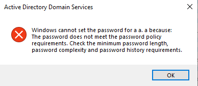
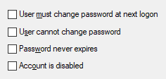
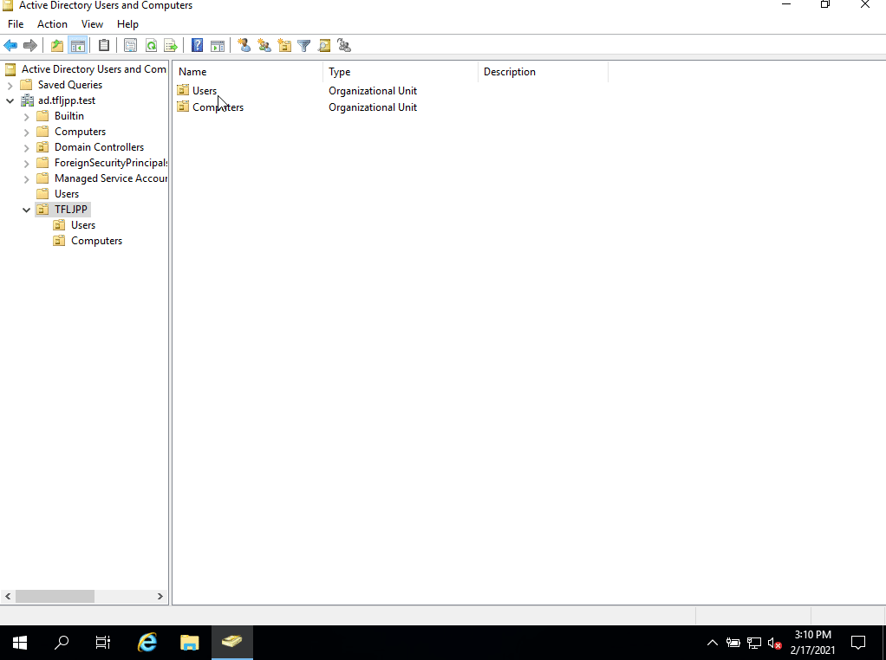

### User Information

To create a new user in AD open ADUC, go to the right OU (in our case `TFLJPP-> Users`) and right click on in the main window. 

This should give you a menu that allows you to select `New >`. This will span a second menu that allows you to create new AD Objects. Here you choose `User`.

From here a window will spawn that will help you create a new user. During this creation you are asked to fill in all the mandatory attributes and are given the chance to fill/activate/disable some optional ones.

Enter a First and Last Name. The Full name will get filled in for you. Now enter you need to enter usernames. There are 2 options:

- User Logon Name;
- User logon name (Pre-Windows 2000)

The User Logon Name is the User Principal Name (UPN). The Pre-Windows 2000 logon name is the sAMAccountName. AD still supports the Pre-Windows 2000 logon name for backward compatibly for older software that can integrated with AD.

{}
Yes even in INSERT_CURRENT_YEAR_NUMBER_HERE there are still software packages out there (and in use by corporations) that don't support the new username format that has been added in the year 2000. 😢
{}

Once you are done filling out the information you can click on `Next >`.

### Users Password

Now you need to set the users password. By default the Domain password requirements are as following:

- The password should not contain the user’s account name or parts of the user’s full name that exceed two consecutive characters
- The password should at least be six characters in length
- The password should contain characters from *atleast* three of the following four categories:
  - uppercase characters (A through Z)
  - lowercase characters (a through z)
  - Base 10 digits (0 through 9)
  - Non-alphabetic characters (for example, !, $, #, %)

If you try to set a password that does not meet these requirements you will be prompted with a error message.

{}
Yes, banana2021! or Banana2021 is a password that complies with the default password policy. 😢 
{}

When setting a password you also have the ability to set these 4 options. 

By default the option 'User must change password at next logon' is enabled. This will ensure that the user needs tp change his password the next time he logs onto a PC. 

{}
This option can give issues with the Remote Desktop Protocol since it does not support this feature.
{}

{}
Yes a potential workaround to allow users to reset their password using RDP is to disable Network Level Authentication (NLA). Don't do this. This is a security risk since it can disclose information and could allow DoS attacks. Its basically similar to letting anyone into the enterace of your company; strangers may not have keys to closed doors, but we generally don’t want anyone snooping around the lobby to gather information or to bother the receptionist.
{}

{}
There is this other option that can used overwrite when a password becomes invalid called 'this password never expires'. You should always avoid enabling this value for ~~end users~~ office monkeys user accounts. Especially if you use the default password policy. You should only ever set this value if you are using strong randomly generated passwords (at least +33 chars) and have a manual process in place to still periodically replace the password, for example, I recommend rotating these kind of passwords at least once or twice a year, but preferably once every quarter.
{}

