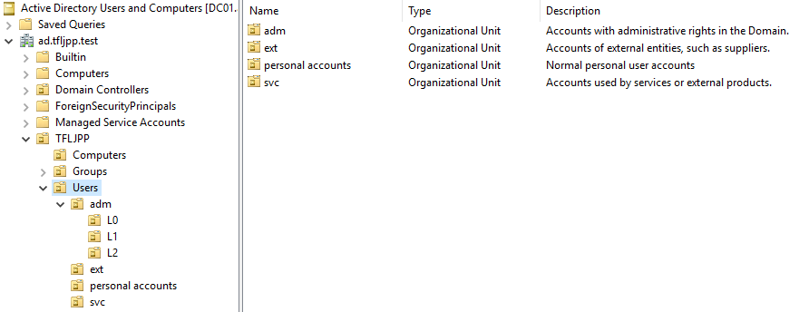

### User Information

So since we work for Mr.Threepwood the first account we are going to create is his. To create a new user in AD open ADUC, go to the right OU (in our case `TFLJPP -> Users`) and right click on in the main window.

This should give you a menu that allows you to select `New >`. This will span a second menu that allows you to create new AD Objects. Here you choose `User`.

From here a window will spawn that will help you create a new user. During this creation you are asked to fill in all the mandatory attributes and are given the chance to fill/activate/disable some optional ones.

Enter a First and Last Name. The Full name will get filled in for you. Now enter you need to enter usernames. There are 2 options:

- User Logon Name;
- User logon name (Pre-Windows 2000)

The User Logon Name is the User Principal Name (UPN). The Pre-Windows 2000 logon name is the sAMAccountName. AD still supports the Pre-Windows 2000 logon name for backward compatibly for older software that can integrated with AD.

{}
Yes even in INSERT_CURRENT_YEAR_NUMBER_HERE there are still software packages out there (and in use by corporations) that don't support the new username format that has been added in the year 2000. 😢
{}

As we discussed earlier during the beginning of Chapter 1, in this Domain we are using the user naming schema of `Firstletter.Lastname`. So for the user `Guybrush Threepwood` we are going to use `G.Threepwood` as its logon name.

Once you are done filling out the information you can click on `Next >`.

### Users Password

Now you need to set the users password. By default the Domain password requirements are as following:

- The password should not contain the user’s account name or parts of the user’s full name that exceed two consecutive characters
- The password should at least be six characters in length
- The password should contain characters from _atleast_ three of the following four categories:
  - uppercase characters (A through Z)
  - lowercase characters (a through z)
  - Base 10 digits (0 through 9)
  - Non-alphabetic characters (for example, !, $, #, %)

If you try to set a password that does not meet these requirements you will be prompted with this error message.

{}
Yes, banana2021! or Banana2021 is a password that complies with the default password policy. 😢 
{}

When setting a password you also have the ability to set these 4 options.

By default the option 'User must change password at next logon' is enabled. This will ensure that the user needs tp change his password the next time he logs onto a PC.

{}
This option can give issues with the Remote Desktop Protocol since it does not support this feature.
{}

{}
Yes a potential workaround to allow users to reset their password using RDP is to disable Network Level Authentication (NLA). Don't do this. This is a security risk since it can disclose information and could allow DoS attacks. Its basically similar to letting anyone into the enterace of your company; strangers may not have keys to closed doors, but we generally don’t want anyone snooping around the lobby to gather information or to bother the receptionist.
{}

{}
There is this other option that can used overwrite when a password becomes invalid called 'this password never expires'. You should always avoid enabling this value for ~~end users~~ office monkeys user accounts. Especially if you use the default password policy. You should only ever set this value if you are using strong randomly generated passwords (at least +33 chars) and have a manual process in place to still periodically replace the password, for example, I recommend rotating these kind of passwords at least once or twice a year, but preferably once every quarter.
{}

So eum yeah, were where we ? Ow yeah, the users password. Type the desired password twice and disable `User must change password at next logon`. Once your done click on `Next >` and then on `Okay`. This should create the new user account.

Once the account is created you can update other attributes, such as the description. Double click on the user and update the description to `A Mighty Pirate`.

### Naming convention

Generally in Active Directory you won't only have 'normal user accounts', meaning accounts that are used by a singular living person. Most likely there all all sorts of different account types.

To ensure clear distinctions between them I always implement a strict naming convection for my groups in production environments for 'non normal user accounts'

General rules I follow with the naming convention:

- Always replace spaces with underscores (`_`).
- Always use lowercase.
- Never use special characters except `_`
- If the name is longer then max of 63 characters I abbreviate things where I see fit.
- I don't enforce these rules on normal personal user accounts.

I generally use the following prefixes:

| prefix_name                | What its used for                                                                                                                                                                        | Example                                         |
| -------------------------- | ---------------------------------------------------------------------------------------------------------------------------------------------------------------------------------------- | ----------------------------------------------- |
| svc_name                   | A Service account. A account that is in use by a service on a external product.                                                                                                          | `svc_palo_alto_user_id`, `svc_sql01_database01` |
| ext_companyname_personname | A account used by a external entity, such as a supplier. Limited to a single user.                                                                                                       | `ext_bigwhoop_l_chuck`                          |
| adm_tier_name              | A account with administrative rights in the domain. Tier refers to system classifications (L0 = important/buisness critical servers, L1 = other/application servers, L2 = workstations ) | `admin_l0_g_threepwood`                         |

I also create separate OU's for each user prefix and ensure that the description explains their function.

