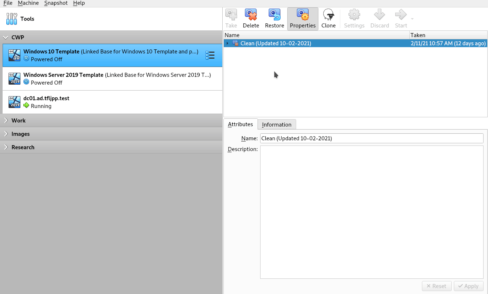
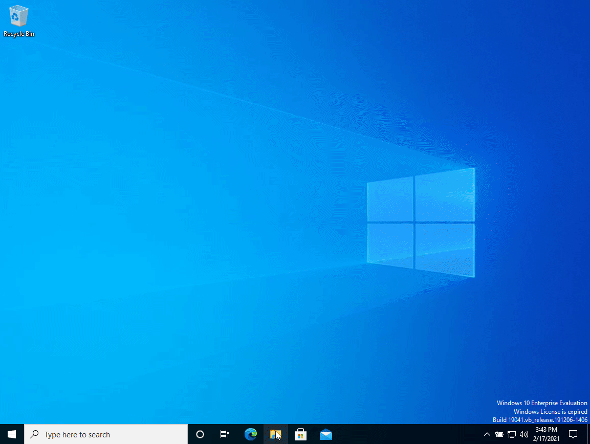
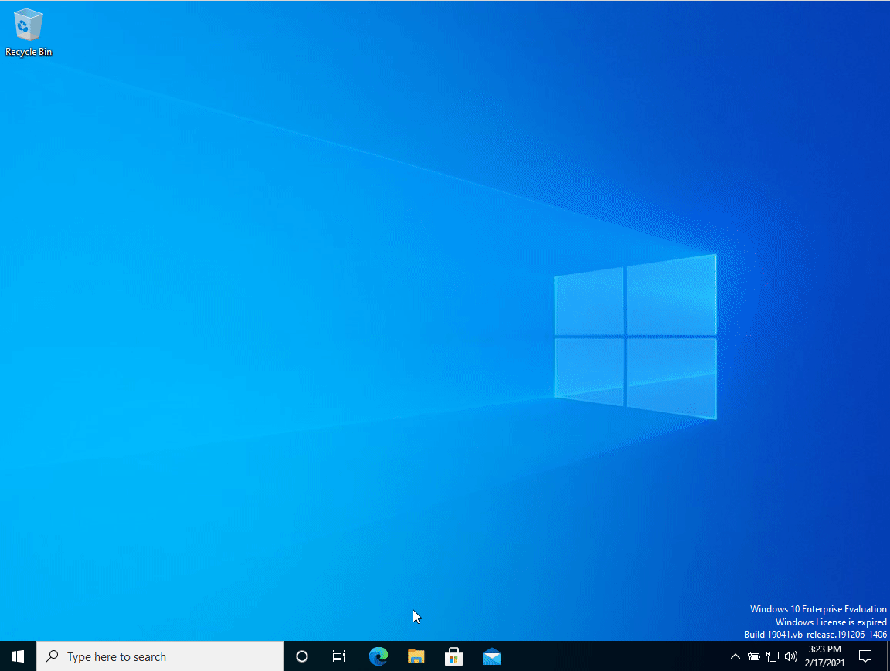
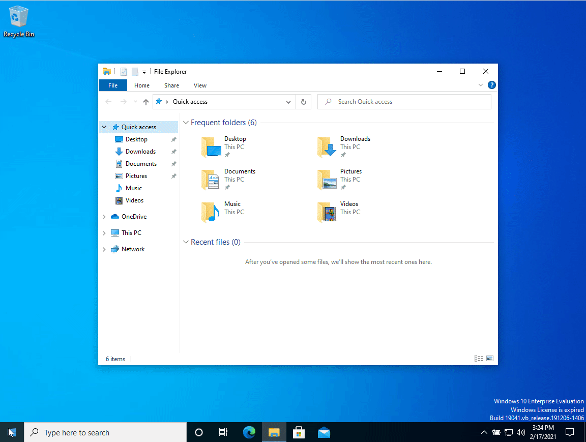
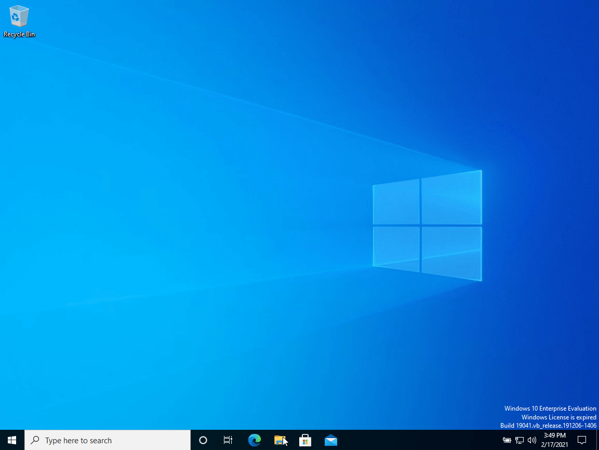
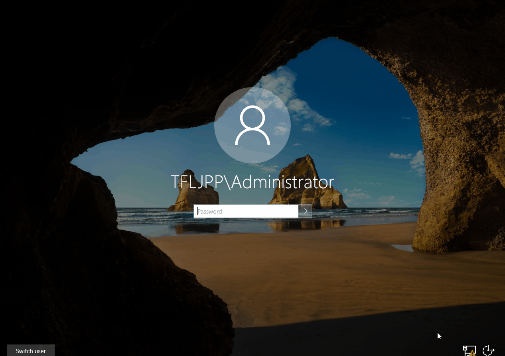

{}
During this part of the guide we will be using the Domain Administrator to add a computer to the domain and login to the computer. You should **NEVER** do this in a production environment. You should have dedicated Tiered and Hardened Admin accounts to logon to workstations. You should use a lockdown and dedicated account to add computers to the Domain. At this point where still explaining the basics of AD, so we haven't configured this yet and shown why this is important.
{}

