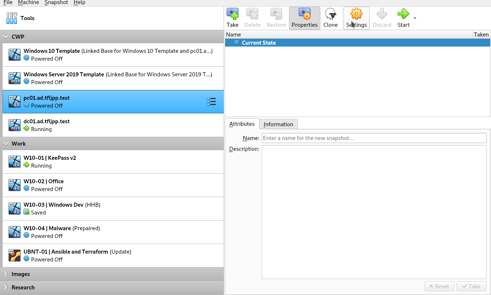
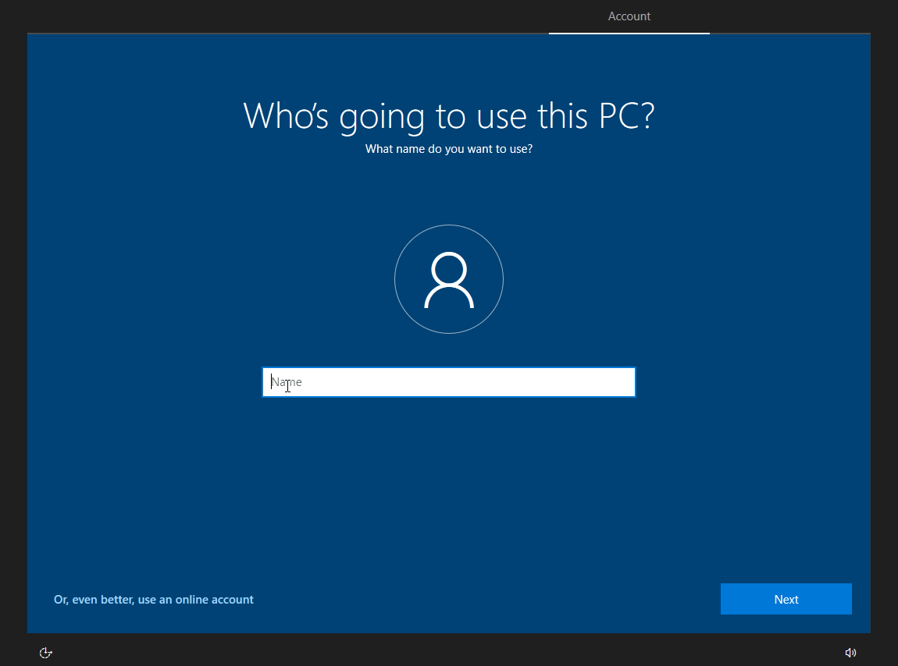

Click on the VM and then click on Clone.

Rename the VM to `pc01.ad.tfljpp.test` and ensure `Linked Clone` is selected. Now change the MAC Address Policy to `Generate new MAC addresses for all network adapters`, then click on Clone.

After cloning, right click on the VM and click on settings, then go the network and change the `Attached to` to `NAT Network`. This should automatically select the newly created VirtualBox Network.

Since we syspred out template we need to run through the initial configuration once again, use the same settings we used during the template creation.

Do note that since we can't add the same (local) twice we use `admin` here instead. The password you should use is `Password01!`.

{}
Again, please don't use passwords like this in production.
{}

Once Windows finishes setting up, can start with changing the computer name and setting up a static IP.
### Rename PC

Open the file explorer and click on `This PC`. Now click anywhere in the white space to the right and choose `Properties`. Then click on `Change Settings` and `Change`. Here you can update the computer name to PC01. Now click on Ok twice and close. You will then be prompted to reboot the workstation.

### Set static IP and correct DNS

Open the file explorer and right click on `Network` and choose `Properties`.
Then click on `Ethernet`, choose `Properties`, `Internet Protocol Version 4 (TCP/IPv4)` and enter the following information.

| IP Address   | Subnet Mask   | Gateway    | DNS         |
| ------------ | ------------- | ---------- | ----------- |
| 10.11.12.100 | 255.255.255.0 | 10.11.12.1 | 10.11.12.10 |

{}
These settings depend on how you setup the Virtual Network properly according to this guide. To verify what your current network settings; Click on start and search for CMD and press enter. Then type `ipconfig` and press enter.
{}

### Test network settings

After changing the settings, we can verify if everything is setup correctly by sending a ping to `dc01.ad.tfljpp.test`.
Click on start and search for CMD. Then type `ping dc01.ad.tfljpp.test` and press enter. It should then ping and reply 4 times.

### Add the PC to the Domain

Now that we have a static IP and setup our DNS correctly we can add this machine to the domain.

Open the file explorer and click on `This PC`. Now click anywhere in the white space to the right and choose `Properties`. Then click on `Change Settings` and `Change`. Here you can select `Domain` and enter the correct domain. This is our root domain `ad.tfljpp.test`. After pressing enter you will be prompted to enter credentials. Login using the Administrator account.

{}
During this part of the guide we will be using the Domain Administrator to add a computer to the domain and login to the computer. You should **NEVER** do this in a production environment. You should have dedicated Tiered and Hardened Admin accounts to logon to workstations. You should also use a lockeddown and dedicated account to add computers to the Domain. At this point where still explaining the basics of AD, so we haven't configured this yet (and shown why this is important).
{}

Now click on Ok three times and close. You will then be prompted to reboot the workstation.

After the reboot you are able to login using a Domain joined account. The first time doing this you will need to clock on 'Other user' and supply the NetBIOS domain name `TFLJPP\` followed by administrator, or login using `administrator@ad.tfljpp.test`.

If you now open the default computer ou in ADUC you can see the new computer here. Move this computer to our custom Computers OU.

