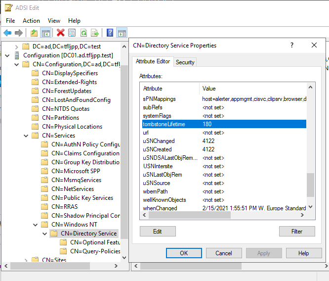
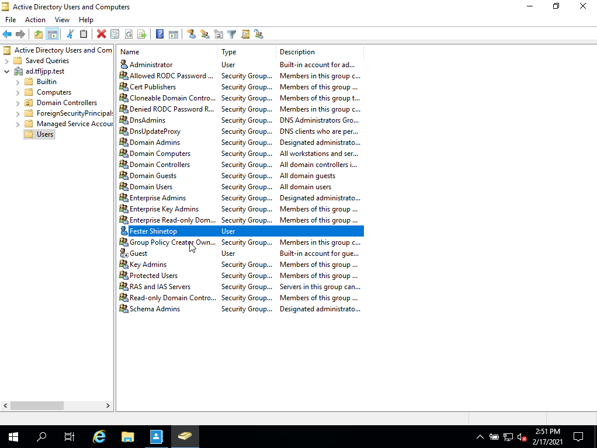

One of the first thing I'd recommend you do any any AD is to enable the AD Active Directory Recycle Bin.

Normally when you remove something from AD its deleted permanently.

Now imagine you work at a Helpdesk. It's early in the morning a you receive a Ticket from a manager asking you to remove a user named F.Shinetop. Duo the lack of your daily dose caffeine combined with a last night all night gaming session you accidentally remove the user V.Shinetop. In this scenario, without AD Recycle Bin, there is no way easy to restore the original user V.Shinetop to its former state without knowing everything that was configured for this account.

To avoid these awkward moments you should enable the AD Recycle Bin. This is a thing that takes seconds to activate but can save you hours of work.

{}
By default a object that has been deleted can be restored within 180 days. This is controled by the `tombstoneLifetime` and  `msDS-deletedObjectLifetime` attributes. When the `msDS-deletedObjectLifetime` attribute is not set the value from the `tombstoneLifetime` attribute is used.

{}

### How to enable the AD Recycle Bin with Active Directory Administrative Center (ADDC)

Open `Start -> Windows Administrative Tools -> Active Directory Administrative Center `

{}
I personally rarely use the `ADDC` for general AD stuff, but it allows for easy setting up of advanced access/authentication policies, fine grained password polices, raising functional levels and enabling the AD Recycle Bin. If not for ADDC you would need to resort to PowerShell for most of these things.
{}

Now right click on `ad (local)` and select `Enable Recycle Bin ...`

Now click on OK twice and it will be enabled. If there are more Domain Controllers in the forest it might take a while for it to replicate to all Domain Controllers.

### How to restore an Object with AD Recycle Bin

