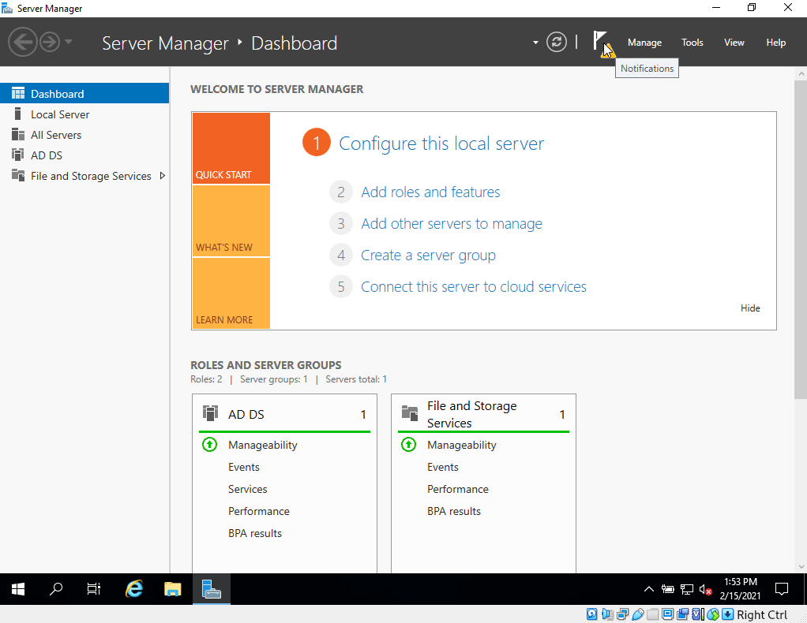
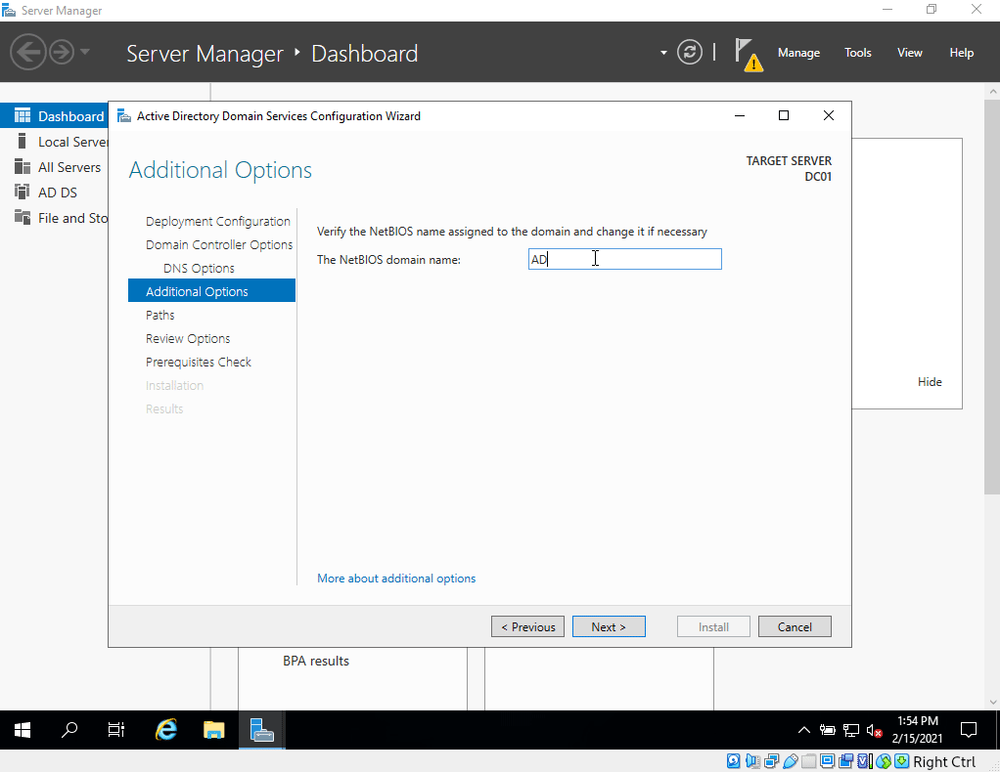

## Features and Roles

Now it is time the first Windows Role gets installed, AD DS. Before installing this Role lets first talk about what Roles and Features are.

Windows Roles and Features are basically programs built-in into windows server itself. These Roles and Features can be installed and uninstalled as per your use case. Whether you want a server to be a file server, a print server, or a web server it all starts with installing a Role or Feature.

If you ever worked with a Linux distribution before, it's kinda similar to a package repository, only these packages are already included in the OS.



## Install the AD DS Role

During the process of this Role installation, we will be prompted by a ton of technical choices and terms. During this part of the guide will just 'blast through' most of them. They will be explained after the installation process.

To install the AD DS role open server manager and click on `Manage -> Add roles and Features`.

Click on `Skip this page by default`

Choose `Role-based of Feature-based Installation` and click on next.

{}
The other option refers to Remote Desktops Services. Remote Desktops are central 'workspaces' that allow multiple users to work on the same server. Generally, depending on hardware configurations, 10 to 15 users would be working on the same Remote Desktop Server (RDS). If configured correctly, you can even access these RDS's remotely from outside of the office. Generally, RDS's are used by businesses as cost saving measures or to provide remote/work from home solutions.
{}

Leave the selection on `DC01` and click on next.

{}
This page allows you to select one or multiple other servers in the domain/network to install roles and features on remotely. Since we currently only have one server we just leave it on the default.
{}

Choose `Active Directory Domain Services` and `Add Features`. Then click on Next.

Since we won't need any extra features we can skip the features page by clicking on Next.

The next page is informational. Just click on Next.

Now click on `Restart the destination server automatically if required` and then click on Install.

## Promote to Domain Controller

Now it's time to promote this server to a Domain Controller. Since this is a new AD this will become the Primary Domain Controller, or PDC for short. Within server manger click on the flag with the warning sign, then click on `Promote this server to a domain controller`

Now select `Add a new forest` and use `ad.tfljpp.test` as the root domain name. Then click on Next.

Leave everything on default on this page and enter the DSRM password `Password01!`.

{}
Again, please use strong and unique passwords in production environments. Do not use a weak password or reuse the password of Administrator like we did during this guide.
{}

{}
If something in Active Directory or on the Domain Controller breaks, and I mean horribly breaks, you have the option to boot into a safe mode called Directory Services Restore Mode, or DSRM for short. DSRM allows you to repair or recover the Active Directory database. DSRM is essentially a 'built-in backdoor' to the AD Database.
{}

{}
Fun fact that is not generally known, most public explications on DSRM tell you what I just explained to you above. If you ask a random IT Administrator what happens to local users when configure a DC, they will probably tell you that "All local users are deleted during the promotion process to a Domain Controller", this is actually partially true 😄. What they don't know is that the `DSRM password` is actually the local administrator user on the Domain Controller and that it can be used for [offensive](https://adsecurity.org/?p=1714) [purposes](https://adsecurity.org/?p=1785). It can be used as an backdoor in more ways that it was indented to 👺. By default, the local Administrator is used for DSRM and disabled when the system is not booted into this DSRM safe mode, unless someone is trying to be sneaky and updates some registry keys to enable this.
{}

Just click on Next on the DNS Options page.

Now you will be prompted to enter a NetBIOS Domain Name. Enter `TFLJPP` and click on Next.

Leave all the settings on the Paths page on the defaults and click on Next.

{}
In production environments I'd recommend using separate hard drives for these paths. Using separate hard drives comes with multiple advantages, some are a bit complicated and out of scope (Backup strategies/IOPS/disk partitions block sizes), but a simple example would be preventing something like Windows Updates from eating up all available the disks space and cause issues with AD updating values in it's database.
{}

Click Next on the Review Options page.

Normally you would double check if everything is up to snuff, but you paid attention to the guide and followed it to the T right? 😄

If you did the Prerequisites Check page you should have 2 warnings. 1 regarding cryptography algorithms and one regarding DNS delegation. Both are expected. Click on Install and wait for it to Finish. Eventually you will be prompted that you are about to be signed out. Soon after the server will reboot.

After the server has rebooted you will notice the logon name now includes the NetBIOS domain name. This means you are currently login on using a Domain User, in this case Administrator. By default, the password of the local administrator has been synced to the Domain Administrator, meaning you can logon using the same password you used previously up to this point.

If you open and browse start you will notice that 'Windows Administrative Tools' now includes tools to manage AD.

[Congratulations](https://www.youtube.com/watch?v=oyFQVZ2h0V8), you just installed your first Domain Controller, and thereby Active Directory! 🎊

