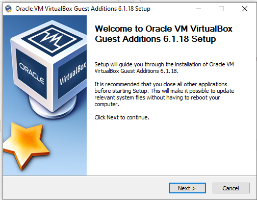

## Creating the VM

Click on `New`

Change the name to `Windows 10 Template` and the version to `Windows 10 64-bit` and click Next.

Set the memory size to a minimum of 2048MB

Choose `Create a virutal had disk now` and click Next.

Choose `VDI (VirtualBox Disk Image)` and click Next.

Choose `Dynamically allocated` and click Next.

Use at least `60GB` of disk space and click create.

**Note:** This space is Dynamically allocated, meanings it won't take up the full 60GB at the start.
Your virtual hard disk will grow on your physical harddisk when start using the space inside on your VM.

Click on your new `Windows 10 Template` VM and then on `Settings`.

From here go to `Storage` , click on `Empty`, select `Live CD/DVD` and then click on the CD/DVD icon and `Choose a disk file...`.

Go to the location where you stored the Windows ISO's we downloaded previously and select the Windows 10 ISO, then click on OK.

**Note:** It probably has something like `CLIENTENTERPRISEEVAL` in its name.

## Installing Windows 10

To start your VM double click on `Windows 10 Template`.

When you start the VM this prompt could pop up. When it does click on Cancel.

Now you should be greeted with the Windows 10 installation. Leave all the options on this screen on English/US and click on Next.

Now here you need to accept the license terms. You can read them if you want to, or just simply accept the fact that you need to accept them anyhow if you want to use the product and click on Next.

Here we need to select how we are going to install Windows. Click on `Custom: Install Windows only (advanced)`

Now click on `Drive 0 Unallocated Space` (this is your virtual harddisk) and click on Next.

Now wait for the installation process to complete.

## Post installation configuration

Once the installation is completed you will be created with this screen. Here we need todo some post installation configuration.

Select `United States` and click on Yes.

Again, select US and click on Yes.

Here simply click on Skip.

Now we are prompted to choose our account type.Since we are using these templates for testing purposes we don't want to link them to a online account, so click on `Domain join instead`

{}
On previous iterations of the windows installer you had the option to create a `Local Account`, this option has been renamed to `Domain join instead`.
{}

Enter `user` as the username

Enter `Password01!` as the password.

{}
You should **not** use a weak password like this in a production environment. For **local testing purposes** (i.e. not connected to the public internet and segmented in a virtual network)  this should be fine.
{}

Now confirm the password.

{}
Again, please don't use these weak passwords like this in production. Sadly I still find passwords like these on almost all my internal assessments.
{}

{}
I always add the login credentials to the descriptions of my **local testing** VMs so I can't forget them. I recommend you do this also.
{}

Now you need enter 3 security questions. You can just use bogus answers. We can always reset the password using multiple other methods, If we even manage to forget this easy password in the first place.

Now we have to go through somethings i'd like to call `MicroSpyingSoft` settings. Just disable every option and click on accept.

{} Unless you are a wierdo and want to talk to your pc. You wierdo.{}

Now simply do as Microsoft says and let them handle things. Just sit back and relax while Windows is being setup.

## Windows updates

Once Windows has been fully setup we can start updating it to the latest version. Click on start and go to `Settings`.

Search for updates.

And click on `Check for updates`.

During this process you will need to reboot multiple times and keep checking for new updates.

You know when you are done updating when the 'Check for updates' button returns 'You're up to date' and returns no further updates.

## Windows time

Since a Active Directory is sensitive to time (de)synchronization issues between Clients and Active Directory it is imported we setup system time correctly in our templates.

To open the system time settings right click on the date/time on the startbar en select `Adjust date/time`.

Now update the time zone to your local zone. (Mine is UTC+01:00). Just remember to set the same time zone on the next template we create.

If the time is incorrect/not updating after changing the time zone, turn off and on `Set time automatically`. This should fix it.

## Guest additions

One of the last things we need todo in our template is install VirtualBox guest additions.

Once you are done updating your VM go to `Devices -> Insert guest additions CD image` in Virtualbox. If this is the first time doing this you **might** be prompted to download them, if so click on Download. If not skip the next 3 steps.

Click on Download.

After it finishes downloading click on Insert.

Now open the file explorer and browse to `This PC`, then click on the `CD Drive`.

Then run `VBoxWindowsAdditions-amd64`.

Click on Yes.

Then keep clicking next until the installation prompts you to install device software.

When it asks you install device software to click Install

Now the Guest additions installation should finish up. Once its done check `reboot now` and once its rebooted shutdown the VM.

When the machine has fully powered off click on the VM and open `Settings`. Now go to `Storage`, select the `VBoxGuestAdditions...`-drive and right click on it. Then click on `Remove Attachment` and then Remove.

## Create Snapshot

Since we now have a VM in a nice clean and prepared state we want to create a snapshot of it. A snapshot is basically a copy of your VM at a given point in time. This snapshot will allow us to create `Linked clone` which will save us time and disk space.

Back in VirtualBox click on the 3 squares and lines next to the VM. Then choose `Snapshots` and click on `Take`. Now enter a name for the snapshot. In the case of Templates I like to note down what kind it is (in this case a clean VM) and when it was last updated.

## Finished!

Now we are done with the preparation of the Windows 10 Template. Let's do this whole thing all over again but with Windows Server 2019.
