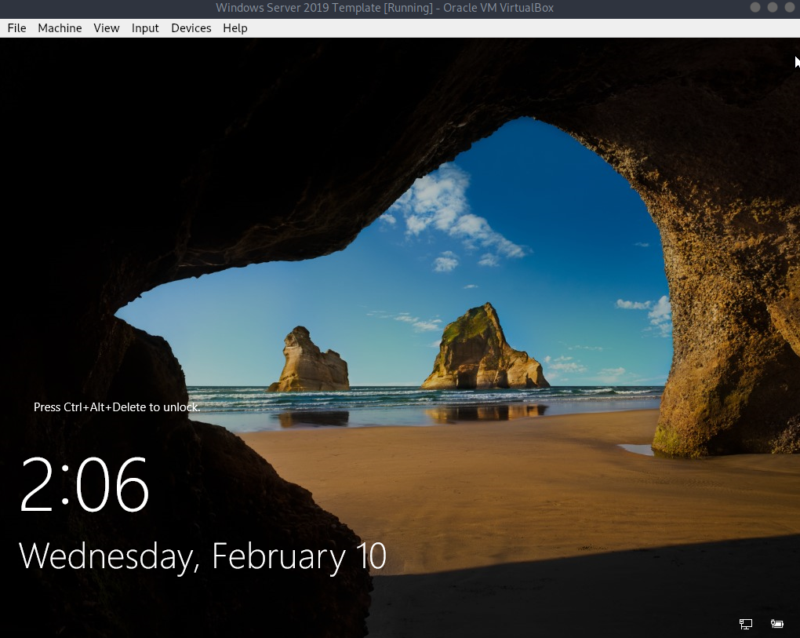

Input -> keyboard -> 'Insert ctrl+alt+del'

If the time is incorrect after changing the time zone, turn of and on 'set time automatically'.

Once you are done updating your VM go to "Devices -> 'Insert guest additions CD image'" in virtualbox