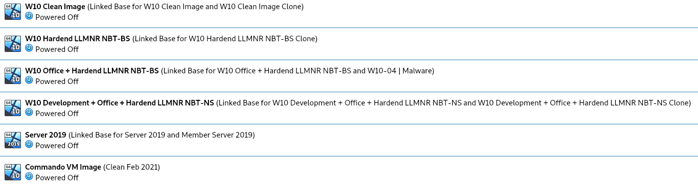

To save on time and disk space we will be creating 2 Templates. 1 Windows Server template and Windows 10 Client Template.

Doing so will allow us to create `Linked Clones` from snapshots. A linked clone is a virtual machine whose virtual disk links to another virtual machine's virtual disk. This enables it to only save the differences in files and data compared to the linked virtual machine.

TL:DR Less space, more VMs

This 'technique' is not limited to this guide. I personally use this all the time and have multiple templates which all derive from each other.

