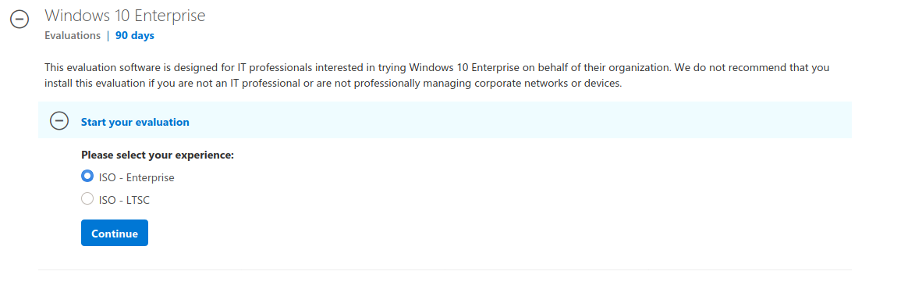
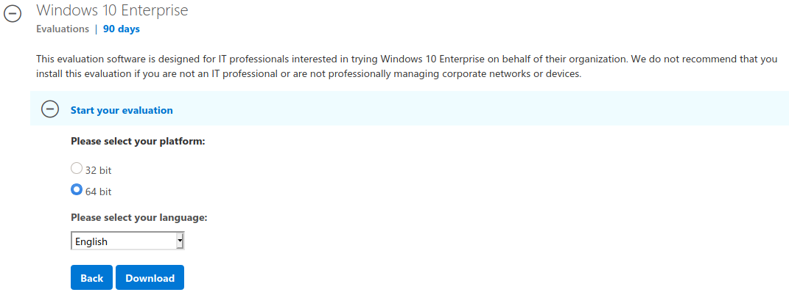
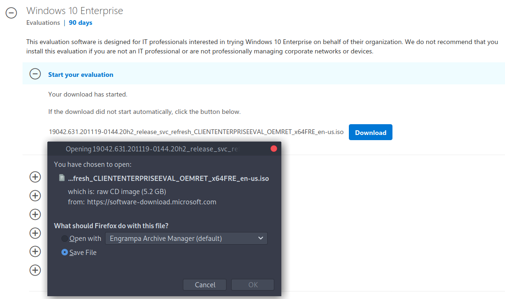
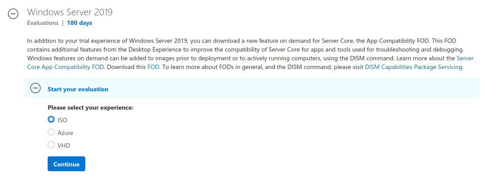
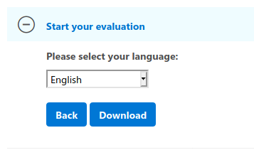
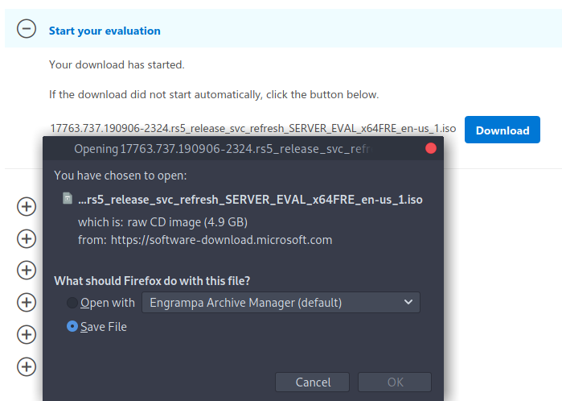

First of all before we can start installing VMs we need to download the operating systems. Luckily for us Microsoft offers users to download trial versions of their OS.



## Fake name generator

When downloading trial ISO's Microsofts website it will require some personal information. If you don't want to enter valid info you can use the following site: [Fake Name Generator](https://nl.fakenamegenerator.com/gen-random-nl-nl.php).



## Download Windows 10 ISO

Click on the following link: [Download Windows 10 ISO](https://www.microsoft.com/en-us/evalcenter/evaluate-windows-10-enterprise)

Select `ISO - Enterprise` and click on Continue.

Enter the required information and click on Continue.



Select `64-Bit` and `English`. Then click on Download.

Save this file somewhere save for later.

## Download Windows Server 2019 ISO

Click on the following link: [Download Server 2019 ISO](https://www.microsoft.com/en-us/evalcenter/evaluate-windows-server-2019?filetype=ISO)

Select `ISO` and click on Continue.

Enter the required information and click on Continue.



Select `English` and then click on Download

Save this file somewhere save for later.

