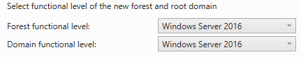

As you might remember from earlier, roles are builtin packages into Windows Server. This means that each release of Windows Server might have different version of the builtin packages. The AD DS Role is a great example of this.

Over the years with new releases of Windows Server new functionality has been consistently added to AD. This means however that you can run into issues if you where to support these new features while still having old Domain Controllers. This is where Functional Levels jump in. 

Functional Levels determine which version of Windows Server are allowed to host the AD DS role in the domain. During the installation process we use a Domain Functional Level of Windows Server 2016, since we want to make use of the newest features. This means that we can only create Domain Controllers using at least Windows Server 2016. Any version lower, for example Server 2012R2, will not be able to be promoted to a Domain Controller is this Domain or other Trees in this forest.

{}
The tech savvy among you probably already thought of a work around. Yes you could create new child domains or forests for the purpose to support older or new versions of AD DS, though it is highly recommended phase out older Windows Servers running Domains Controllers in your Domain in favor of newer version of Windows Server. This allows you to use most recent functional level and make use of the newest features, a lot of which have been security focused.
{}
