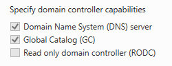

RODC are Read-Only Domain Controllers. Though we did not install one, i'd still like to cover it briefly.
Read-Only Domain Controllers can be used for some specific use cases such as branch offices where you would not want to host a full Domain Controller for security reasons. These locations could be physically less secure. By default, no AD account passwords are cached on a RODC and the Domain does not allow no changes originating from a RODC's AD database, SYSVOL, or DNS.

A Read-Only Domain Controller would allow people in this branch office to still authenticate if, lets say, their VPN connection to the main office went down.

{}
Though if RODCs are not deployed properly, it's possible that the RODC [can create a scenario](https://adsecurity.org/?p=3592) where an attacker could escalate privileges through the RODC up to and including full control of Active Directory.
{}