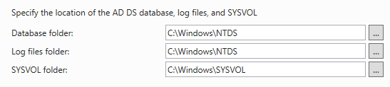
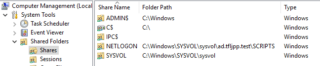

SYSVOL is a folder that exists on all Domain Controllers. It a central place to store important Active Directory files, such as Group Policies (GPO's for short), ADMX files (Extra group policy templates) and logon/logoff/startup/shutdown scripts that each user and computer account in the domain should have access to. A service called `Distributed File Replication Service` or DFRS for short, replications the contents of the SYSVOL folder among Domain Controllers in the Domain. This way if a new Logon scripts or GPO is added on 1 Domain Controller it gets replicated to all other Domain Controllers in the Domain.

As noted to earlier, the SYSVOL folder is accessiable to all users and computer accounts in the Domain. This is because the SYSVOL folder is made available as a file share on the Domain Controller.

You also might notice a NETLOGON share. The NETLOGON share is basically a second share that shares a subfolder from the SYSVOL share, the SCRIPTS folder.

{}
As an attacker this a great place to search for information about the Domain. More often then not we can even find credentials stored in SYSVOL (and NETLOGON), even though this should not happen ([anymore](https://adsecurity.org/?p=2288)).
{}
